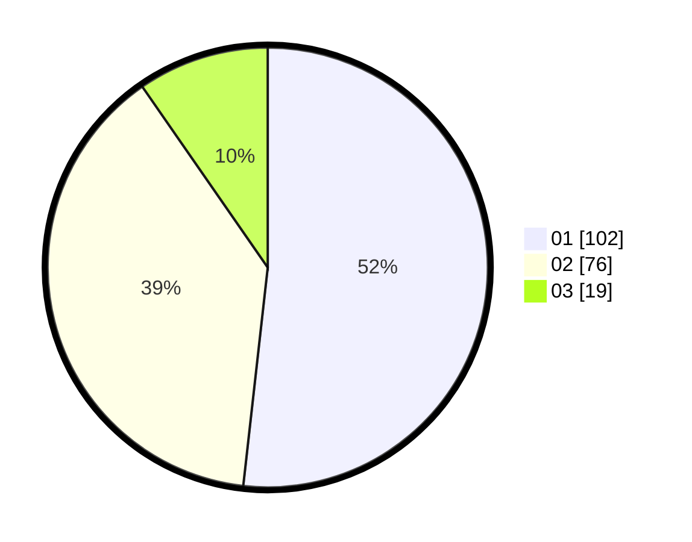

# Hasil

Hasil perolehan suara paslon dapat dilihat pada file paslon-01.txt, paslon-02.txt, dan paslon-03.txt.

Jika tidak ada, artinya data tersebut belum ada pada SIREKAP.

## Perolehan Suara

 * Paslon 01: **102**.
 * Paslon 02: **76**.
 * Paslon 03: **19**.

## Foto C Plano

https://sirekap-obj-formc.kpu.go.id/44ea/pemilu/ppwp/31/73/06/10/02/3173061002032-20240216-151240--4dab53ae-c1c0-4d82-b472-17e1ea1a7515.jpg

https://sirekap-obj-formc.kpu.go.id/44ea/pemilu/ppwp/31/73/06/10/02/3173061002032-20240216-151242--c6e4a7f7-af2d-472e-aeeb-4b2415e88c58.jpg

https://sirekap-obj-formc.kpu.go.id/44ea/pemilu/ppwp/31/73/06/10/02/3173061002032-20240216-151241--fdbf4038-ae02-4ba6-a847-8705a4afdcf7.jpg

## DATA PEMILIH TETAP

Jumlah pemilih dalam DPT: **245**.
 * L: **120**.
 * P: **125**.

## DATA PENGGUNA HAK PILIH

Jumlah pengguna hak pilih dalam DPT: **198**.
 * L: **100**.
 * P: **98**.

Jumlah pengguna hak pilih dalam DPTb: **2**.
 * L: **0**.
 * P: **2**.

Jumlah pengguna hak pilih dalam DPK: **2**.
 * L: **2**.
 * P: **0**.

Jumlah pengguna hak pilih: **202**.
 * L: **102**.
 * P: **100**.

## JUMLAH SUARA SAH DAN TIDAK SAH

JUMLAH SELURUH SUARA SAH: **197**.

JUMLAH SUARA TIDAK SAH: **5**.

JUMLAH SELURUH SUARA SAH DAN SUARA TIDAK SAH: **202**.
