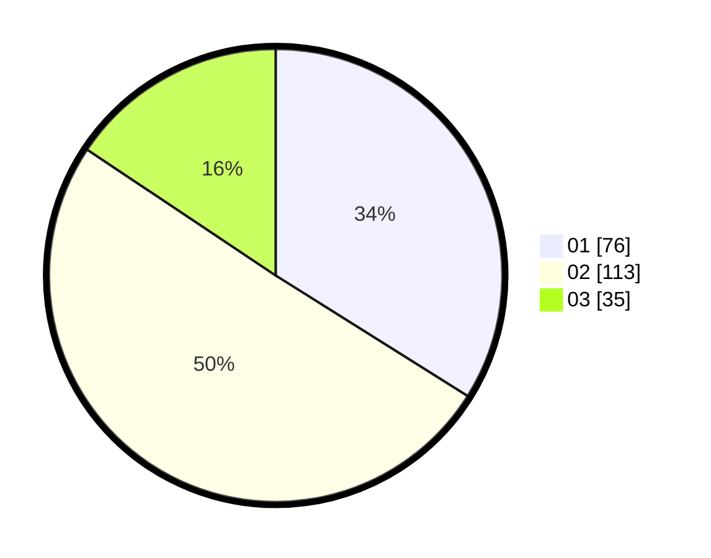

# Hasil

Hasil perolehan suara paslon dapat dilihat pada file paslon-01.txt, paslon-02.txt, dan paslon-03.txt.

Jika tidak ada, artinya data tersebut belum ada pada SIREKAP.

## Perolehan Suara

 * Paslon 01: **76**.
 * Paslon 02: **113**.
 * Paslon 03: **35**.

## Foto C Plano

https://sirekap-obj-formc.kpu.go.id/5532/pemilu/ppwp/31/73/06/10/02/3173061002034-20240215-030256--1d2ab0ad-83b0-4397-b7d7-beaa0a6ad5db.jpg

https://sirekap-obj-formc.kpu.go.id/5532/pemilu/ppwp/31/73/06/10/02/3173061002034-20240215-032249--1c3e0def-d21e-4f5d-8b90-fc63b8644252.jpg

https://sirekap-obj-formc.kpu.go.id/5532/pemilu/ppwp/31/73/06/10/02/3173061002034-20240215-033016--9e4e6573-b575-46bb-b192-a209aee25b13.jpg
