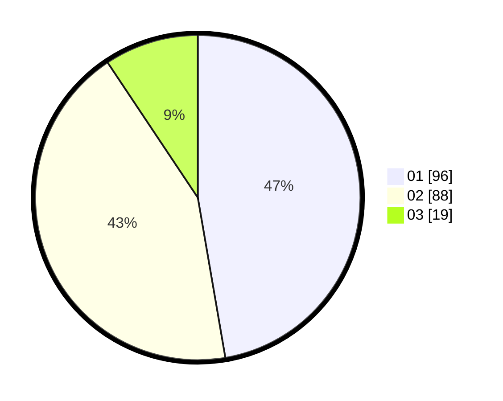

# Hasil

Hasil perolehan suara paslon dapat dilihat pada file paslon-01.txt, paslon-02.txt, dan paslon-03.txt.

Jika tidak ada, artinya data tersebut belum ada pada SIREKAP.

## Perolehan Suara

 * Paslon 01: **96**.
 * Paslon 02: **88**.
 * Paslon 03: **19**.

## Foto C Plano

https://sirekap-obj-formc.kpu.go.id/7841/pemilu/ppwp/31/73/06/10/02/3173061002035-20240214-220444--4e57c7f0-dd85-4fd7-9059-0699d3297be1.jpg

https://sirekap-obj-formc.kpu.go.id/7841/pemilu/ppwp/31/73/06/10/02/3173061002035-20240214-222358--0a85f1fb-5654-4b14-a06c-605d99567884.jpg

https://sirekap-obj-formc.kpu.go.id/7841/pemilu/ppwp/31/73/06/10/02/3173061002035-20240214-222501--90f8fe11-8733-45e5-848a-c60218da6e3d.jpg
