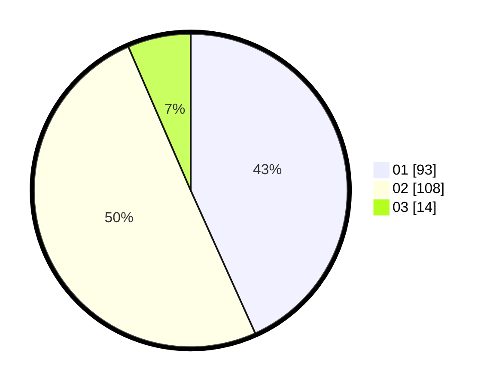

# Hasil

Hasil perolehan suara paslon dapat dilihat pada file paslon-01.txt, paslon-02.txt, dan paslon-03.txt.

Jika tidak ada, artinya data tersebut belum ada pada SIREKAP.

## Perolehan Suara

 * Paslon 01: **93**.
 * Paslon 02: **108**.
 * Paslon 03: **14**.

## Foto C Plano

https://sirekap-obj-formc.kpu.go.id/e688/pemilu/ppwp/31/73/06/10/02/3173061002036-20240214-215201--583703c7-fbb6-4654-88ac-189d8f4450eb.jpg

https://sirekap-obj-formc.kpu.go.id/e688/pemilu/ppwp/31/73/06/10/02/3173061002036-20240214-224822--f82cebba-40e3-4ee4-a7f1-090cdb547aa5.jpg

https://sirekap-obj-formc.kpu.go.id/e688/pemilu/ppwp/31/73/06/10/02/3173061002036-20240214-224902--14082d1c-acd0-4822-b10a-98b48156f99d.jpg
