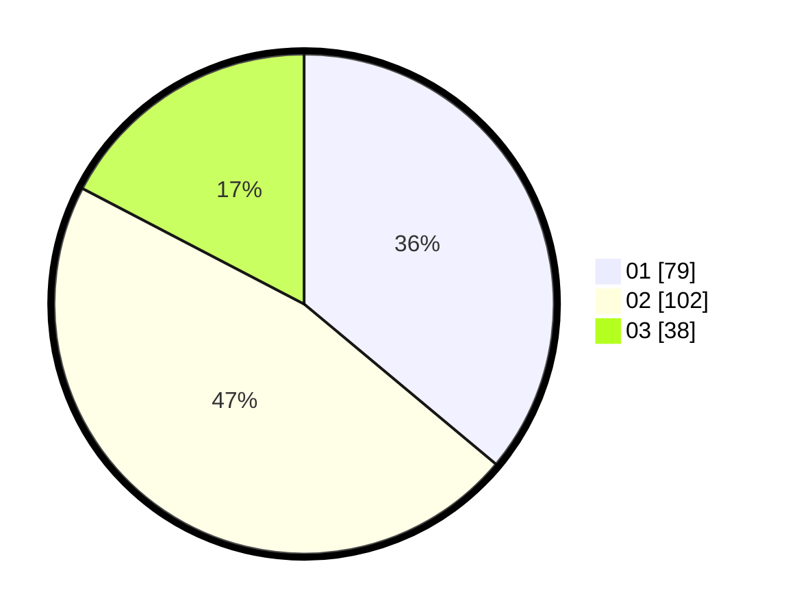

# Hasil

Hasil perolehan suara paslon dapat dilihat pada file paslon-01.txt, paslon-02.txt, dan paslon-03.txt.

Jika tidak ada, artinya data tersebut belum ada pada SIREKAP.

## Perolehan Suara

 * Paslon 01: **79**.
 * Paslon 02: **102**.
 * Paslon 03: **38**.

## Foto C Plano

https://sirekap-obj-formc.kpu.go.id/e188/pemilu/ppwp/31/73/06/10/02/3173061002039-20240214-221155--122d36b5-1146-4a9f-8f4f-beba989d1fd3.jpg

https://sirekap-obj-formc.kpu.go.id/e188/pemilu/ppwp/31/73/06/10/02/3173061002039-20240214-221222--7ae5a52d-46fa-46eb-b127-76a700e7ca5c.jpg

https://sirekap-obj-formc.kpu.go.id/e188/pemilu/ppwp/31/73/06/10/02/3173061002039-20240214-221241--3e1de8be-80ff-4b0f-a519-4ae403a03ed9.jpg
