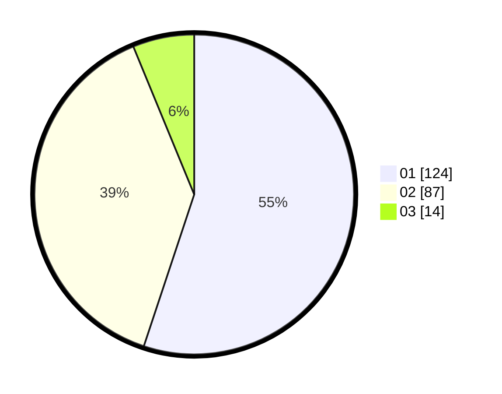

# Hasil

Hasil perolehan suara paslon dapat dilihat pada file paslon-01.txt, paslon-02.txt, dan paslon-03.txt.

Jika tidak ada, artinya data tersebut belum ada pada SIREKAP.

## Perolehan Suara

 * Paslon 01: **124**.
 * Paslon 02: **87**.
 * Paslon 03: **14**.

## Foto C Plano

https://sirekap-obj-formc.kpu.go.id/915a/pemilu/ppwp/31/73/06/10/02/3173061002043-20240215-002945--3ea6b07d-483b-4680-acdc-46b626cedf3c.jpg

https://sirekap-obj-formc.kpu.go.id/915a/pemilu/ppwp/31/73/06/10/02/3173061002043-20240215-010657--cacfe252-434d-47ca-9915-8d4ce792c28b.jpg

https://sirekap-obj-formc.kpu.go.id/915a/pemilu/ppwp/31/73/06/10/02/3173061002043-20240215-010731--fe31006f-c2e6-40ae-b9ce-ab49879f52c0.jpg
