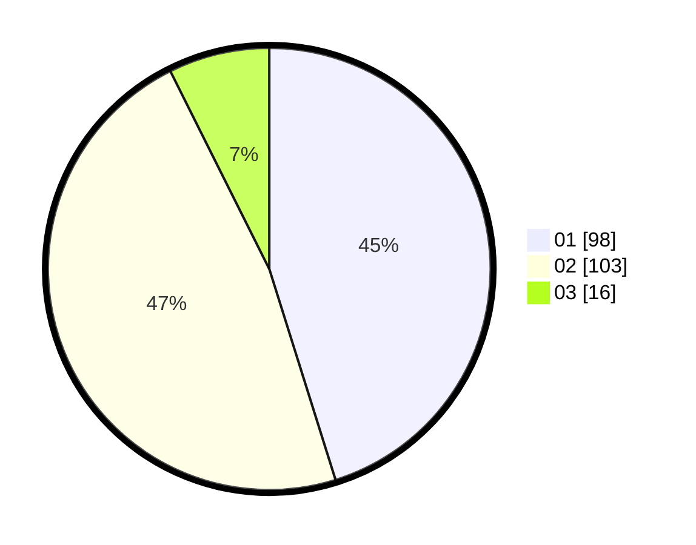

# Hasil

Hasil perolehan suara paslon dapat dilihat pada file paslon-01.txt, paslon-02.txt, dan paslon-03.txt.

Jika tidak ada, artinya data tersebut belum ada pada SIREKAP.

## Perolehan Suara

 * Paslon 01: **98**.
 * Paslon 02: **103**.
 * Paslon 03: **16**.

## Foto C Plano

https://sirekap-obj-formc.kpu.go.id/eea8/pemilu/ppwp/31/73/06/10/02/3173061002044-20240214-195718--935023fb-fd9b-4e28-83af-d832e352ada5.jpg

https://sirekap-obj-formc.kpu.go.id/eea8/pemilu/ppwp/31/73/06/10/02/3173061002044-20240214-195904--5ca056f5-b611-4da0-9d15-fd479f0f3ec3.jpg

https://sirekap-obj-formc.kpu.go.id/eea8/pemilu/ppwp/31/73/06/10/02/3173061002044-20240214-200031--bbcfa5c1-876f-4496-af00-4bef25d2bafe.jpg

## DATA PEMILIH TETAP

Jumlah pemilih dalam DPT: **274**.
 * L: **133**.
 * P: **141**.

## DATA PENGGUNA HAK PILIH

Jumlah pengguna hak pilih dalam DPT: **274**.
 * L: **133**.
 * P: **141**.

Jumlah pengguna hak pilih dalam DPTb: **0**.
 * L: **0**.
 * P: **0**.

Jumlah pengguna hak pilih dalam DPK: **0**.
 * L: **0**.
 * P: **0**.

Jumlah pengguna hak pilih: **274**.
 * L: **133**.
 * P: **141**.

## JUMLAH SUARA SAH DAN TIDAK SAH

JUMLAH SELURUH SUARA SAH: **217**.

JUMLAH SUARA TIDAK SAH: **1**.

JUMLAH SELURUH SUARA SAH DAN SUARA TIDAK SAH: **218**.
