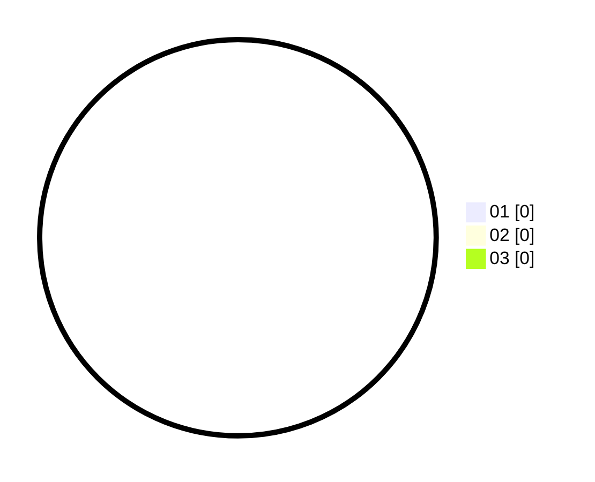

# Hasil

Hasil perolehan suara paslon dapat dilihat pada file paslon-01.txt, paslon-02.txt, dan paslon-03.txt.

Jika tidak ada, artinya data tersebut belum ada pada SIREKAP.

## Perolehan Suara

 * Paslon 01: **0**.
 * Paslon 02: **0**.
 * Paslon 03: **0**.

## Foto C Plano

https://sirekap-obj-formc.kpu.go.id/62c5/pemilu/ppwp/31/73/06/10/02/3173061002048-20240216-152554--d6cb7057-d79a-479c-8bc2-3af448c66716.jpg

https://sirekap-obj-formc.kpu.go.id/62c5/pemilu/ppwp/31/73/06/10/02/3173061002048-20240216-152555--695c18c7-6c14-4cba-81c4-f186bd74d6cb.jpg

https://sirekap-obj-formc.kpu.go.id/62c5/pemilu/ppwp/31/73/06/10/02/3173061002048-20240216-152555--fa4cc9f7-1245-49f6-8477-1af1b601ad2a.jpg

## DATA PEMILIH TETAP

Jumlah pemilih dalam DPT: **274**.
 * L: **133**.
 * P: **141**.

## DATA PENGGUNA HAK PILIH

Jumlah pengguna hak pilih dalam DPT: **174**.
 * L: **83**.
 * P: **90**.

Jumlah pengguna hak pilih dalam DPTb: **2**.
 * L: **1**.
 * P: **1**.

Jumlah pengguna hak pilih dalam DPK: **9**.
 * L: **4**.
 * P: **5**.

Jumlah pengguna hak pilih: **185**.
 * L: **88**.
 * P: **96**.

## JUMLAH SUARA SAH DAN TIDAK SAH

JUMLAH SELURUH SUARA SAH: **187**.

JUMLAH SUARA TIDAK SAH: **2**.

JUMLAH SELURUH SUARA SAH DAN SUARA TIDAK SAH: **189**.
