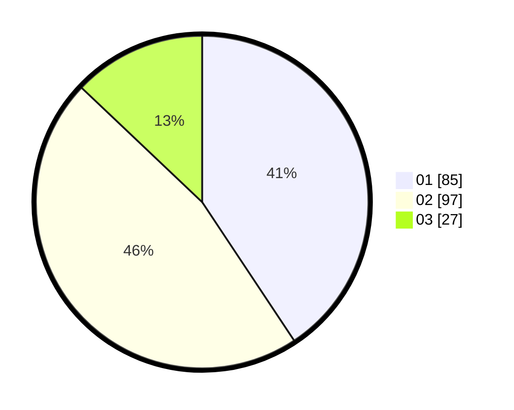

# Hasil

Hasil perolehan suara paslon dapat dilihat pada file paslon-01.txt, paslon-02.txt, dan paslon-03.txt.

Jika tidak ada, artinya data tersebut belum ada pada SIREKAP.

## Perolehan Suara

 * Paslon 01: **85**.
 * Paslon 02: **97**.
 * Paslon 03: **27**.

## Foto C Plano

https://sirekap-obj-formc.kpu.go.id/a46a/pemilu/ppwp/31/73/06/10/02/3173061002051-20240215-025019--bbe95035-a14e-4cd7-be84-1606ac425172.jpg

https://sirekap-obj-formc.kpu.go.id/a46a/pemilu/ppwp/31/73/06/10/02/3173061002051-20240215-025130--79608d81-5f03-4192-9a3e-d51d18fd8d3a.jpg
