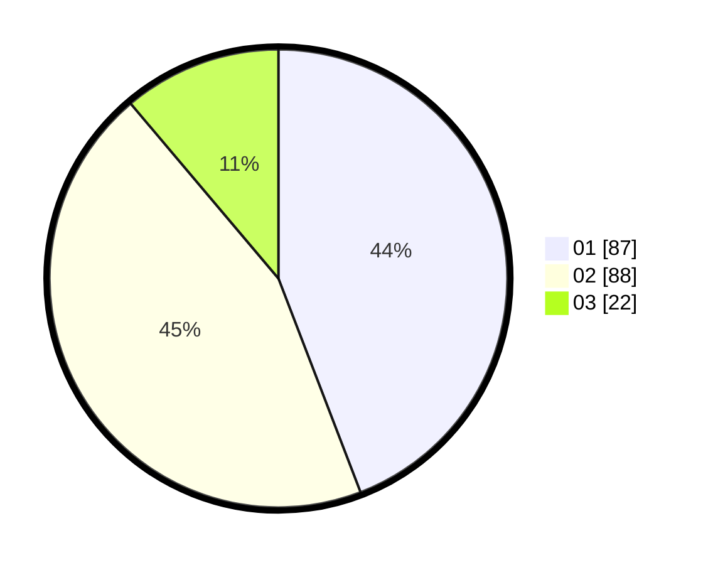

# Hasil

Hasil perolehan suara paslon dapat dilihat pada file paslon-01.txt, paslon-02.txt, dan paslon-03.txt.

Jika tidak ada, artinya data tersebut belum ada pada SIREKAP.

## Perolehan Suara

 * Paslon 01: **87**.
 * Paslon 02: **88**.
 * Paslon 03: **22**.

## Foto C Plano

https://sirekap-obj-formc.kpu.go.id/0755/pemilu/ppwp/31/73/06/10/02/3173061002054-20240216-035928--7a6eb8f4-f212-4362-b68c-9e0221fc46c6.jpg

https://sirekap-obj-formc.kpu.go.id/0755/pemilu/ppwp/31/73/06/10/02/3173061002054-20240216-035930--82a60a13-eff9-43f9-bd55-0774c6f5c87c.jpg

https://sirekap-obj-formc.kpu.go.id/0755/pemilu/ppwp/31/73/06/10/02/3173061002054-20240216-035928--822f4d90-a475-4e43-a6d2-722365fe6f4b.jpg

## DATA PEMILIH TETAP

Jumlah pemilih dalam DPT: **268**.
 * L: **128**.
 * P: **140**.

## DATA PENGGUNA HAK PILIH

Jumlah pengguna hak pilih dalam DPT: **197**.
 * L: **91**.
 * P: **106**.

Jumlah pengguna hak pilih dalam DPTb: **2**.
 * L: **1**.
 * P: **1**.

Jumlah pengguna hak pilih dalam DPK: **0**.
 * L: **0**.
 * P: **0**.

Jumlah pengguna hak pilih: **199**.
 * L: **92**.
 * P: **107**.

## JUMLAH SUARA SAH DAN TIDAK SAH

JUMLAH SELURUH SUARA SAH: **197**.

JUMLAH SUARA TIDAK SAH: **2**.

JUMLAH SELURUH SUARA SAH DAN SUARA TIDAK SAH: **199**.
