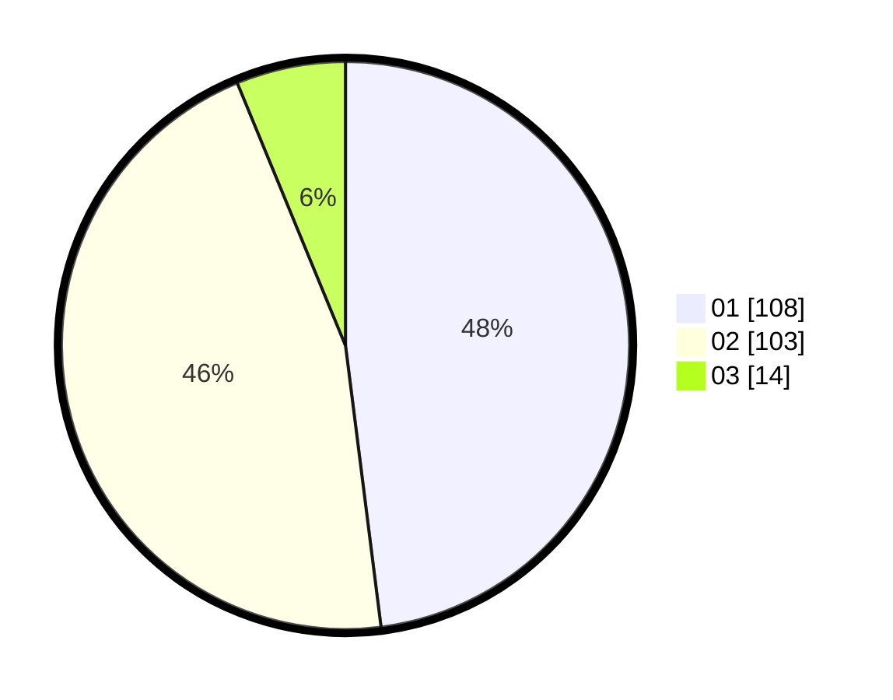

# Hasil

Hasil perolehan suara paslon dapat dilihat pada file paslon-01.txt, paslon-02.txt, dan paslon-03.txt.

Jika tidak ada, artinya data tersebut belum ada pada SIREKAP.

## Perolehan Suara

 * Paslon 01: **108**.
 * Paslon 02: **103**.
 * Paslon 03: **14**.

## Foto C Plano

https://sirekap-obj-formc.kpu.go.id/7c9f/pemilu/ppwp/31/73/06/10/02/3173061002057-20240214-223031--ddda4714-9dd8-4cfd-81f6-8c41d2090720.jpg

https://sirekap-obj-formc.kpu.go.id/7c9f/pemilu/ppwp/31/73/06/10/02/3173061002057-20240214-223120--1d06c06a-c2be-46c2-b80c-ba3ea85c1691.jpg

https://sirekap-obj-formc.kpu.go.id/7c9f/pemilu/ppwp/31/73/06/10/02/3173061002057-20240214-223204--19bdd035-291d-4d23-b7db-3f1b07843317.jpg
