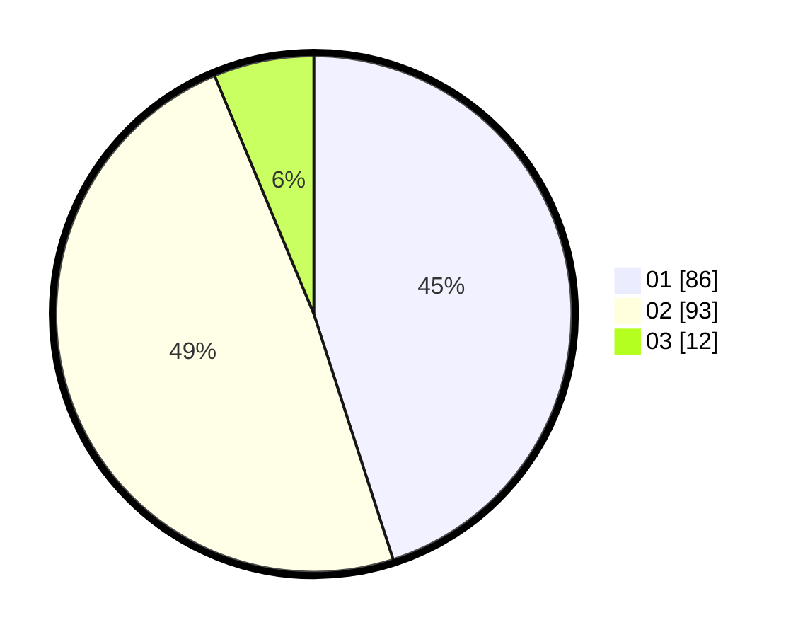

# Hasil

Hasil perolehan suara paslon dapat dilihat pada file paslon-01.txt, paslon-02.txt, dan paslon-03.txt.

Jika tidak ada, artinya data tersebut belum ada pada SIREKAP.

## Perolehan Suara

 * Paslon 01: **86**.
 * Paslon 02: **93**.
 * Paslon 03: **12**.

## Foto C Plano

https://sirekap-obj-formc.kpu.go.id/ddd7/pemilu/ppwp/31/73/06/10/02/3173061002066-20240214-234725--043ac8ca-4edd-4513-ba2a-3aed65267bef.jpg

https://sirekap-obj-formc.kpu.go.id/ddd7/pemilu/ppwp/31/73/06/10/02/3173061002066-20240214-234800--d8c12ad6-9e4b-4dae-83e8-6b4e576e3063.jpg
