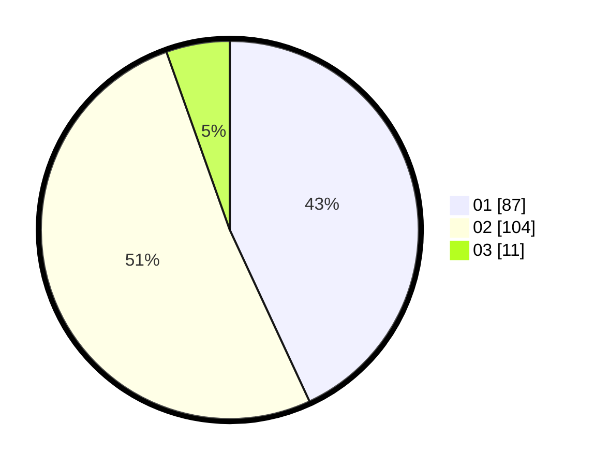

# Hasil

Hasil perolehan suara paslon dapat dilihat pada file paslon-01.txt, paslon-02.txt, dan paslon-03.txt.

Jika tidak ada, artinya data tersebut belum ada pada SIREKAP.

## Perolehan Suara

 * Paslon 01: **87**.
 * Paslon 02: **104**.
 * Paslon 03: **11**.

## Foto C Plano

https://sirekap-obj-formc.kpu.go.id/2534/pemilu/ppwp/31/73/06/10/02/3173061002072-20240214-210238--10a77135-9b2c-4679-b3c0-5fd5ab1e6d14.jpg

https://sirekap-obj-formc.kpu.go.id/2534/pemilu/ppwp/31/73/06/10/02/3173061002072-20240214-210347--fa7c870f-a2a3-45a8-aba2-1849a71ea320.jpg

https://sirekap-obj-formc.kpu.go.id/2534/pemilu/ppwp/31/73/06/10/02/3173061002072-20240214-210454--35b102a9-0dea-49a2-adbf-560d90c40ce3.jpg
