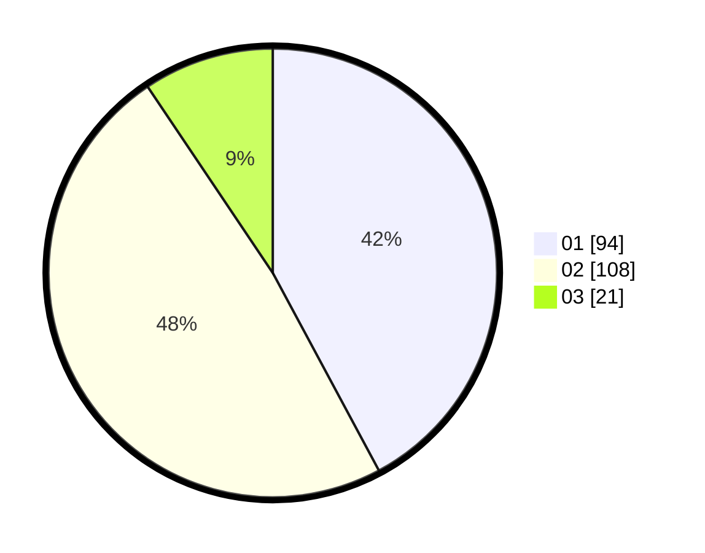

# Hasil

Hasil perolehan suara paslon dapat dilihat pada file paslon-01.txt, paslon-02.txt, dan paslon-03.txt.

Jika tidak ada, artinya data tersebut belum ada pada SIREKAP.

## Perolehan Suara

 * Paslon 01: **94**.
 * Paslon 02: **108**.
 * Paslon 03: **21**.

## Foto C Plano

https://sirekap-obj-formc.kpu.go.id/becb/pemilu/ppwp/31/73/06/10/02/3173061002073-20240214-224957--ebe898e6-5ffc-4c2a-b644-9a94eebbbd03.jpg

https://sirekap-obj-formc.kpu.go.id/becb/pemilu/ppwp/31/73/06/10/02/3173061002073-20240214-212623--004d1a3f-8f5c-4adb-ad8f-c669de8e72b9.jpg

https://sirekap-obj-formc.kpu.go.id/becb/pemilu/ppwp/31/73/06/10/02/3173061002073-20240214-212848--ee6ef367-5fbb-428d-9218-a2a287bebc48.jpg
