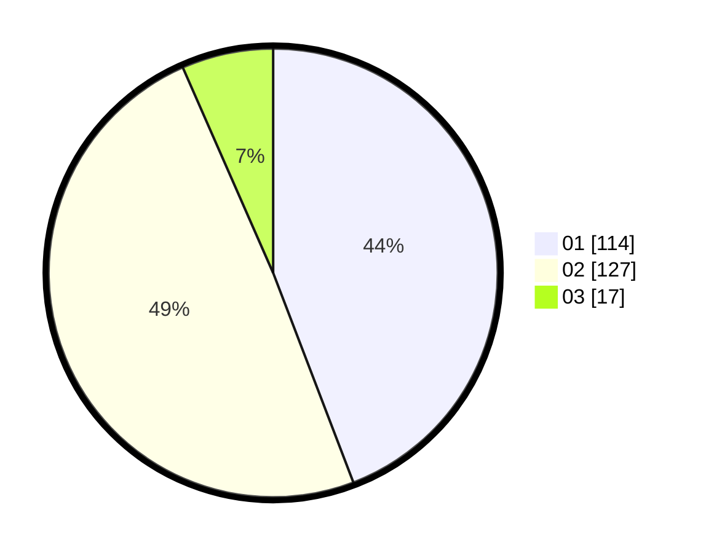

# Hasil

Hasil perolehan suara paslon dapat dilihat pada file paslon-01.txt, paslon-02.txt, dan paslon-03.txt.

Jika tidak ada, artinya data tersebut belum ada pada SIREKAP.

## Perolehan Suara

 * Paslon 01: **114**.
 * Paslon 02: **127**.
 * Paslon 03: **17**.

## Foto C Plano

https://sirekap-obj-formc.kpu.go.id/0ae3/pemilu/ppwp/31/73/06/10/02/3173061002074-20240214-195452--0f197b12-0fdf-49db-95ec-0fa04cf70820.jpg

https://sirekap-obj-formc.kpu.go.id/0ae3/pemilu/ppwp/31/73/06/10/02/3173061002074-20240214-195810--11c06cf8-c86c-49a3-8852-453b6392426d.jpg

https://sirekap-obj-formc.kpu.go.id/0ae3/pemilu/ppwp/31/73/06/10/02/3173061002074-20240214-195537--79202344-de9a-4fa8-969e-f8cbeec60cc4.jpg

## DATA PEMILIH TETAP

Jumlah pemilih dalam DPT: **278**.
 * L: **140**.
 * P: **138**.

## DATA PENGGUNA HAK PILIH

Jumlah pengguna hak pilih dalam DPT: **248**.
 * L: **124**.
 * P: **124**.

Jumlah pengguna hak pilih dalam DPTb: **6**.
 * L: **4**.
 * P: **2**.

Jumlah pengguna hak pilih dalam DPK: **10**.
 * L: **4**.
 * P: **6**.

Jumlah pengguna hak pilih: **264**.
 * L: **132**.
 * P: **132**.

## JUMLAH SUARA SAH DAN TIDAK SAH

JUMLAH SELURUH SUARA SAH: **258**.

JUMLAH SUARA TIDAK SAH: **5**.

JUMLAH SELURUH SUARA SAH DAN SUARA TIDAK SAH: **264**.
