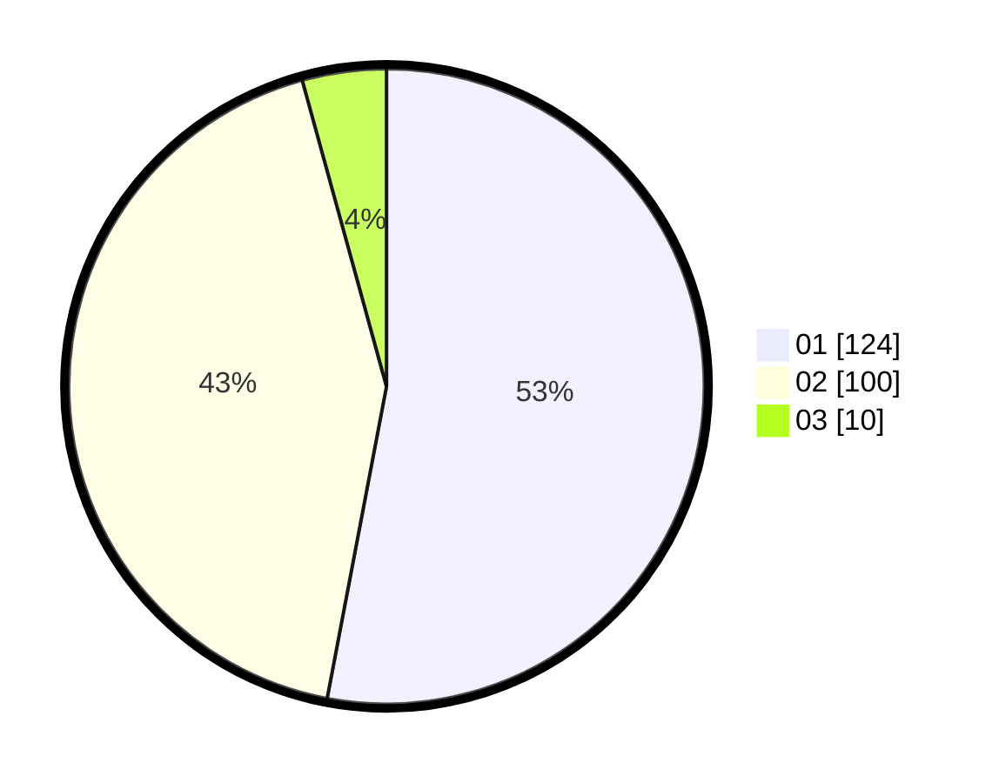

# Hasil

Hasil perolehan suara paslon dapat dilihat pada file paslon-01.txt, paslon-02.txt, dan paslon-03.txt.

Jika tidak ada, artinya data tersebut belum ada pada SIREKAP.

## Perolehan Suara

 * Paslon 01: **124**.
 * Paslon 02: **100**.
 * Paslon 03: **10**.

## Foto C Plano

https://sirekap-obj-formc.kpu.go.id/f212/pemilu/ppwp/31/73/06/10/02/3173061002075-20240214-211413--ea21a9a8-e959-4e78-9a05-43d0d91e171a.jpg

https://sirekap-obj-formc.kpu.go.id/f212/pemilu/ppwp/31/73/06/10/02/3173061002075-20240215-225750--c0423893-82b0-466f-b2c0-09f308a5e11e.jpg

https://sirekap-obj-formc.kpu.go.id/f212/pemilu/ppwp/31/73/06/10/02/3173061002075-20240214-224254--19ceb782-e6af-459b-a54f-29421860f0b8.jpg
