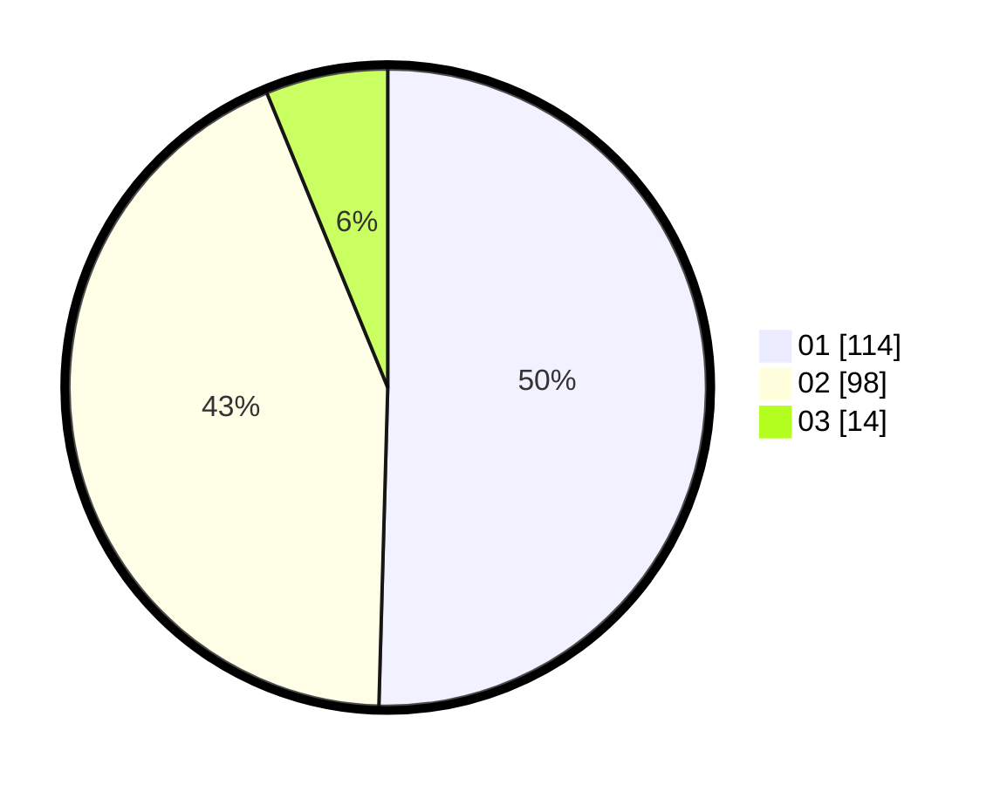

# Hasil

Hasil perolehan suara paslon dapat dilihat pada file paslon-01.txt, paslon-02.txt, dan paslon-03.txt.

Jika tidak ada, artinya data tersebut belum ada pada SIREKAP.

## Perolehan Suara

 * Paslon 01: **114**.
 * Paslon 02: **98**.
 * Paslon 03: **14**.

## Foto C Plano

https://sirekap-obj-formc.kpu.go.id/f1ab/pemilu/ppwp/31/73/06/10/02/3173061002078-20240214-221324--6864a928-413c-4c8e-93cb-b3571c9b0d56.jpg

https://sirekap-obj-formc.kpu.go.id/f1ab/pemilu/ppwp/31/73/06/10/02/3173061002078-20240214-211145--bd3a84b4-aa4a-409e-b244-1772d2d42aa7.jpg

https://sirekap-obj-formc.kpu.go.id/f1ab/pemilu/ppwp/31/73/06/10/02/3173061002078-20240214-211434--769ccc7a-4fca-439e-9c67-24baacee53e6.jpg
