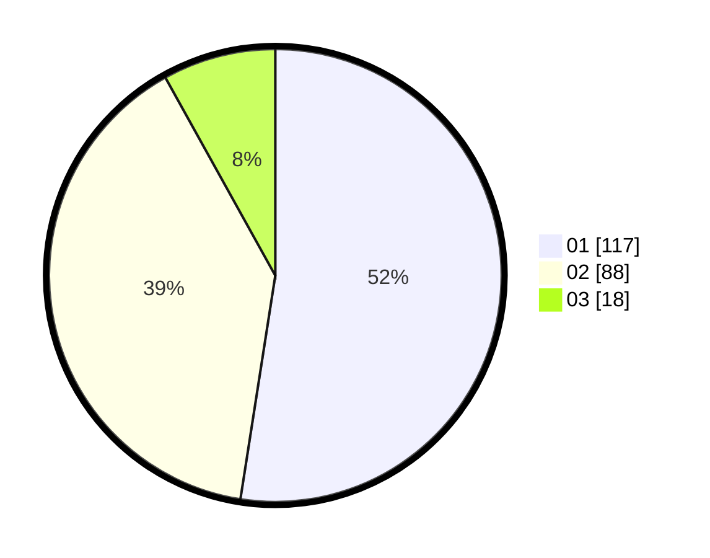

# Hasil

Hasil perolehan suara paslon dapat dilihat pada file paslon-01.txt, paslon-02.txt, dan paslon-03.txt.

Jika tidak ada, artinya data tersebut belum ada pada SIREKAP.

## Perolehan Suara

 * Paslon 01: **117**.
 * Paslon 02: **88**.
 * Paslon 03: **18**.

## Foto C Plano

https://sirekap-obj-formc.kpu.go.id/8b41/pemilu/ppwp/31/73/06/10/02/3173061002083-20240214-211234--3ec88fd5-b434-46ff-aff2-79d22a99b7e2.jpg

https://sirekap-obj-formc.kpu.go.id/8b41/pemilu/ppwp/31/73/06/10/02/3173061002083-20240214-211340--d0b564fe-7691-4c07-9b4d-0d3800f66fb9.jpg

https://sirekap-obj-formc.kpu.go.id/8b41/pemilu/ppwp/31/73/06/10/02/3173061002083-20240214-211606--fe091b62-de54-4913-9aee-67c660a9ed67.jpg

## DATA PEMILIH TETAP

Jumlah pemilih dalam DPT: **276**.
 * L: **132**.
 * P: **144**.

## DATA PENGGUNA HAK PILIH

Jumlah pengguna hak pilih dalam DPT: **227**.
 * L: **104**.
 * P: **223**.

Jumlah pengguna hak pilih dalam DPTb: **1**.
 * L: **0**.
 * P: **1**.

Jumlah pengguna hak pilih dalam DPK: **3**.
 * L: **2**.
 * P: **1**.

Jumlah pengguna hak pilih: **231**.
 * L: **106**.
 * P: **125**.

## JUMLAH SUARA SAH DAN TIDAK SAH

JUMLAH SELURUH SUARA SAH: **223**.

JUMLAH SUARA TIDAK SAH: **8**.

JUMLAH SELURUH SUARA SAH DAN SUARA TIDAK SAH: **231**.
