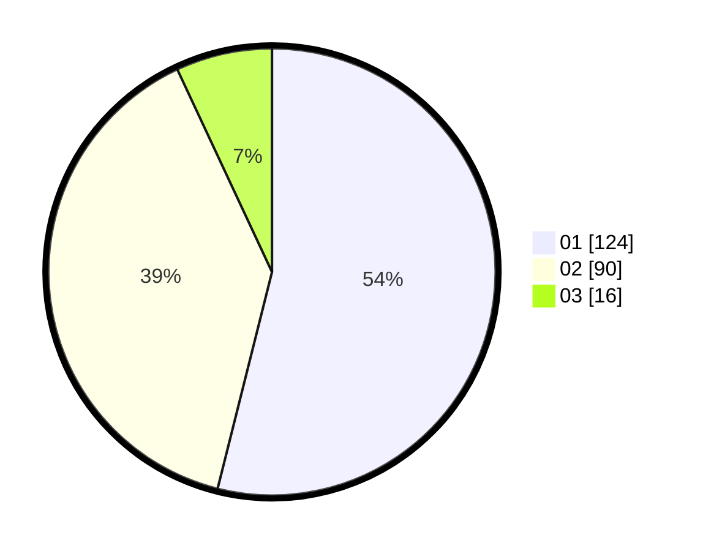

# Hasil

Hasil perolehan suara paslon dapat dilihat pada file paslon-01.txt, paslon-02.txt, dan paslon-03.txt.

Jika tidak ada, artinya data tersebut belum ada pada SIREKAP.

## Perolehan Suara

 * Paslon 01: **124**.
 * Paslon 02: **90**.
 * Paslon 03: **16**.

## Foto C Plano

https://sirekap-obj-formc.kpu.go.id/c070/pemilu/ppwp/31/73/06/10/02/3173061002084-20240216-041549--7fe28d3e-af9e-49c8-94fa-4336c51a6f60.jpg

https://sirekap-obj-formc.kpu.go.id/c070/pemilu/ppwp/31/73/06/10/02/3173061002084-20240214-204103--ad94b0a3-e39d-45a1-8825-815b2e8ab299.jpg

https://sirekap-obj-formc.kpu.go.id/c070/pemilu/ppwp/31/73/06/10/02/3173061002084-20240214-204142--59743314-89ef-4a1f-acdf-b4099cdcdce7.jpg

## DATA PEMILIH TETAP

Jumlah pemilih dalam DPT: **277**.
 * L: **141**.
 * P: **136**.

## DATA PENGGUNA HAK PILIH

Jumlah pengguna hak pilih dalam DPT: **277**.
 * L: **141**.
 * P: **136**.

Jumlah pengguna hak pilih dalam DPTb: **0**.
 * L: **0**.
 * P: **0**.

Jumlah pengguna hak pilih dalam DPK: **4**.
 * L: **3**.
 * P: **1**.

Jumlah pengguna hak pilih: **281**.
 * L: **144**.
 * P: **137**.

## JUMLAH SUARA SAH DAN TIDAK SAH

JUMLAH SELURUH SUARA SAH: **230**.

JUMLAH SUARA TIDAK SAH: **2**.

JUMLAH SELURUH SUARA SAH DAN SUARA TIDAK SAH: **232**.
