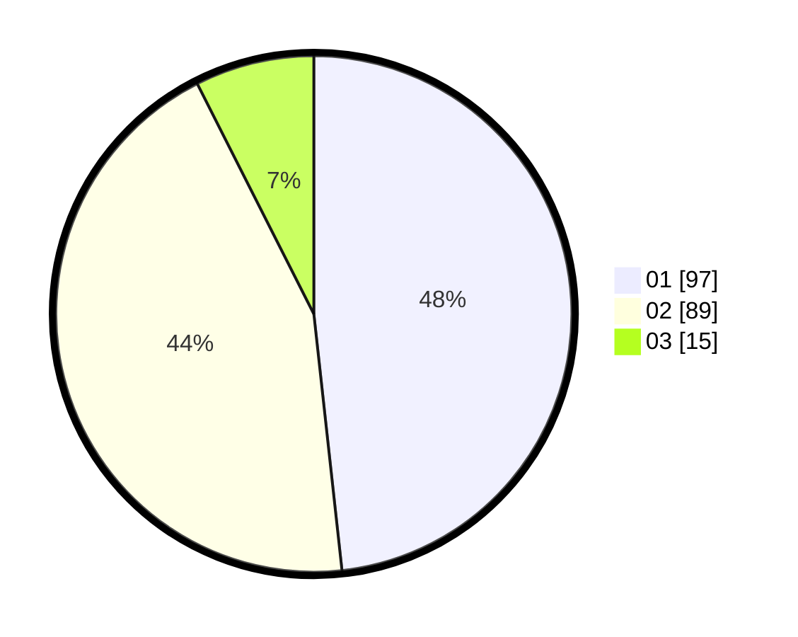

# Hasil

Hasil perolehan suara paslon dapat dilihat pada file paslon-01.txt, paslon-02.txt, dan paslon-03.txt.

Jika tidak ada, artinya data tersebut belum ada pada SIREKAP.

## Perolehan Suara

 * Paslon 01: **97**.
 * Paslon 02: **89**.
 * Paslon 03: **15**.

## Foto C Plano

https://sirekap-obj-formc.kpu.go.id/c697/pemilu/ppwp/31/73/06/10/02/3173061002089-20240214-212958--6b451938-b0e1-4491-85dc-5e31d837d57f.jpg

https://sirekap-obj-formc.kpu.go.id/c697/pemilu/ppwp/31/73/06/10/02/3173061002089-20240214-213700--4ba4421a-f619-4f65-8af9-1d8676e36541.jpg

https://sirekap-obj-formc.kpu.go.id/c697/pemilu/ppwp/31/73/06/10/02/3173061002089-20240214-213331--477b24c8-2b63-41fd-bbc2-31eac9164271.jpg
