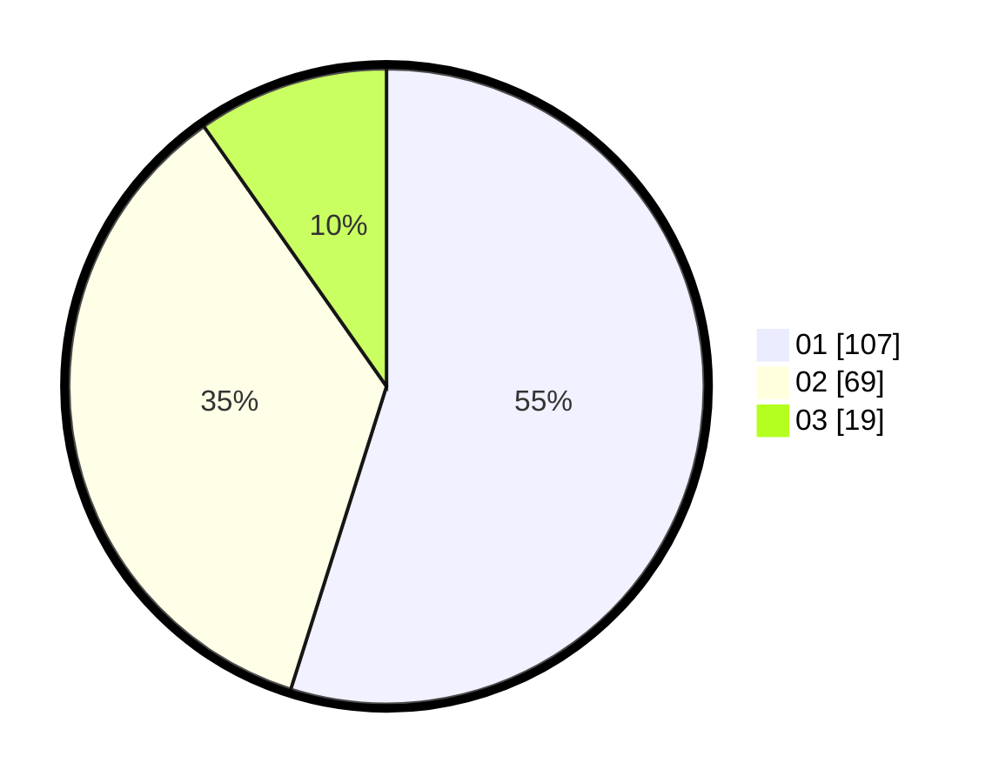

# Hasil

Hasil perolehan suara paslon dapat dilihat pada file paslon-01.txt, paslon-02.txt, dan paslon-03.txt.

Jika tidak ada, artinya data tersebut belum ada pada SIREKAP.

## Perolehan Suara

 * Paslon 01: **107**.
 * Paslon 02: **69**.
 * Paslon 03: **19**.

## Foto C Plano

https://sirekap-obj-formc.kpu.go.id/ea89/pemilu/ppwp/31/73/06/10/02/3173061002090-20240214-222806--5ecc974c-b2d9-4400-9d3f-e24376f83059.jpg

https://sirekap-obj-formc.kpu.go.id/ea89/pemilu/ppwp/31/73/06/10/02/3173061002090-20240214-222827--71a86c8e-286d-497f-98c4-1c654cd9dfa0.jpg

https://sirekap-obj-formc.kpu.go.id/ea89/pemilu/ppwp/31/73/06/10/02/3173061002090-20240214-222817--5aebc63d-f866-433c-90db-9de9ed3ddd2e.jpg

## DATA PEMILIH TETAP

Jumlah pemilih dalam DPT: **233**.
 * L: **112**.
 * P: **121**.

## DATA PENGGUNA HAK PILIH

Jumlah pengguna hak pilih dalam DPT: **194**.
 * L: **89**.
 * P: **105**.

Jumlah pengguna hak pilih dalam DPTb: **0**.
 * L: **0**.
 * P: **0**.

Jumlah pengguna hak pilih dalam DPK: **2**.
 * L: **0**.
 * P: **2**.

Jumlah pengguna hak pilih: **196**.
 * L: **89**.
 * P: **107**.

## JUMLAH SUARA SAH DAN TIDAK SAH

JUMLAH SELURUH SUARA SAH: **195**.

JUMLAH SUARA TIDAK SAH: **1**.

JUMLAH SELURUH SUARA SAH DAN SUARA TIDAK SAH: **196**.
