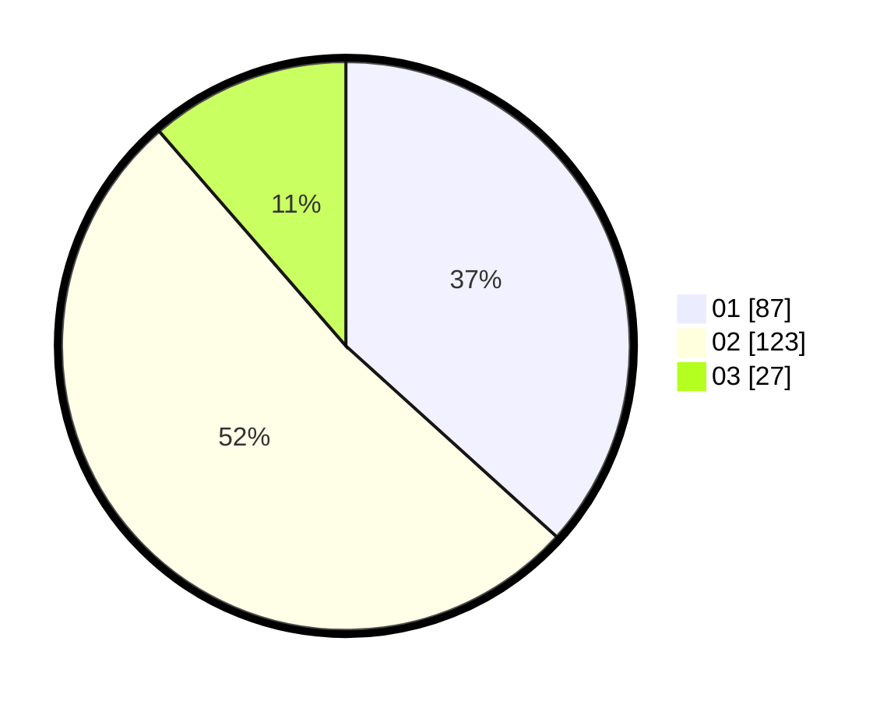

# Hasil

Hasil perolehan suara paslon dapat dilihat pada file paslon-01.txt, paslon-02.txt, dan paslon-03.txt.

Jika tidak ada, artinya data tersebut belum ada pada SIREKAP.

## Perolehan Suara

 * Paslon 01: **87**.
 * Paslon 02: **123**.
 * Paslon 03: **27**.

## Foto C Plano

https://sirekap-obj-formc.kpu.go.id/69c2/pemilu/ppwp/31/73/06/10/02/3173061002092-20240214-231234--bbf087ad-f4aa-4c7f-9954-01d0737fc0c0.jpg

https://sirekap-obj-formc.kpu.go.id/69c2/pemilu/ppwp/31/73/06/10/02/3173061002092-20240214-231338--c370a1f4-df24-4d9c-9822-bc8101d93421.jpg

https://sirekap-obj-formc.kpu.go.id/69c2/pemilu/ppwp/31/73/06/10/02/3173061002092-20240214-231423--d536cc0e-d4fa-40b1-8bad-65e05be3cd62.jpg
