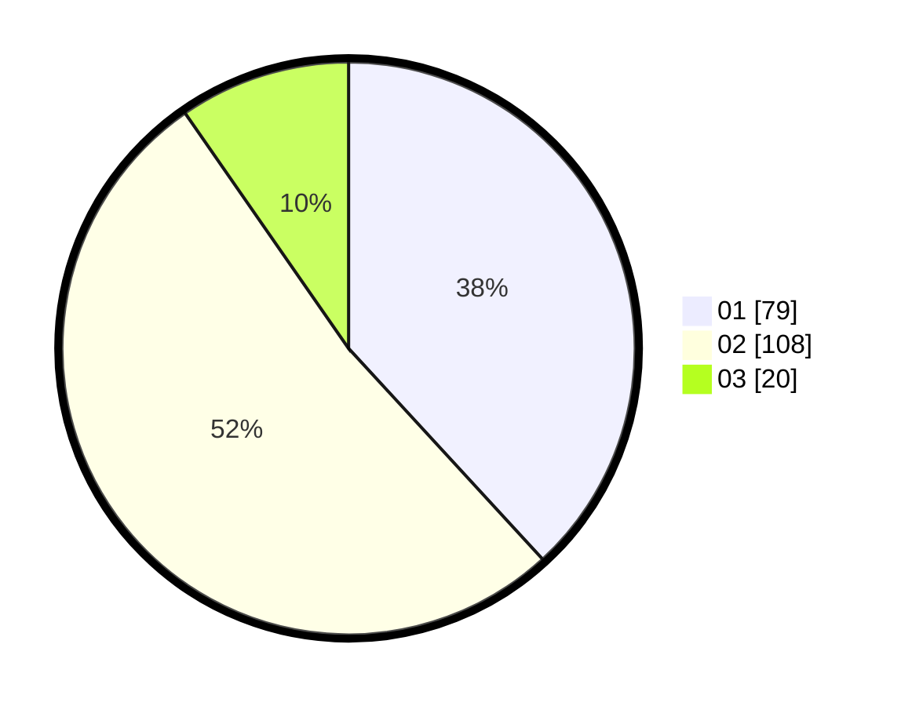

# Hasil

Hasil perolehan suara paslon dapat dilihat pada file paslon-01.txt, paslon-02.txt, dan paslon-03.txt.

Jika tidak ada, artinya data tersebut belum ada pada SIREKAP.

## Perolehan Suara

 * Paslon 01: **79**.
 * Paslon 02: **108**.
 * Paslon 03: **20**.

## Foto C Plano

https://sirekap-obj-formc.kpu.go.id/9eda/pemilu/ppwp/31/73/06/10/02/3173061002093-20240215-025821--387de46c-5e63-4480-bb2b-844c3edff80b.jpg

https://sirekap-obj-formc.kpu.go.id/9eda/pemilu/ppwp/31/73/06/10/02/3173061002093-20240215-025904--adfd039b-5820-4ef0-8430-e967880e0468.jpg

https://sirekap-obj-formc.kpu.go.id/9eda/pemilu/ppwp/31/73/06/10/02/3173061002093-20240215-000206--800effa0-7a2a-4fd6-9d67-cb9f06ed8282.jpg
