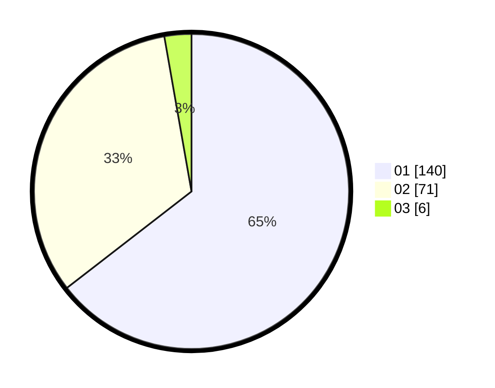

# Hasil

Hasil perolehan suara paslon dapat dilihat pada file paslon-01.txt, paslon-02.txt, dan paslon-03.txt.

Jika tidak ada, artinya data tersebut belum ada pada SIREKAP.

## Perolehan Suara

 * Paslon 01: **140**.
 * Paslon 02: **71**.
 * Paslon 03: **6**.

## Foto C Plano

https://sirekap-obj-formc.kpu.go.id/be35/pemilu/ppwp/31/73/06/10/02/3173061002094-20240214-233727--00a1b23c-9bad-4f8d-8cff-0fd80ecd8af8.jpg

https://sirekap-obj-formc.kpu.go.id/be35/pemilu/ppwp/31/73/06/10/02/3173061002094-20240214-233445--8c476920-0047-446f-85f0-d92027dbc849.jpg

https://sirekap-obj-formc.kpu.go.id/be35/pemilu/ppwp/31/73/06/10/02/3173061002094-20240214-233535--11350ed0-a179-401d-840a-83ac5b71901e.jpg
