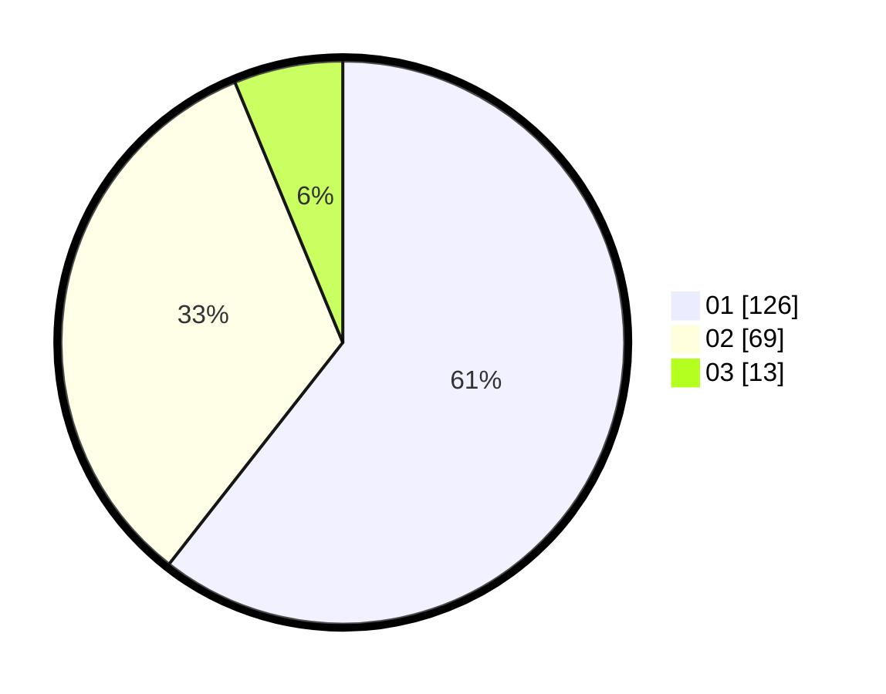

# Hasil

Hasil perolehan suara paslon dapat dilihat pada file paslon-01.txt, paslon-02.txt, dan paslon-03.txt.

Jika tidak ada, artinya data tersebut belum ada pada SIREKAP.

## Perolehan Suara

 * Paslon 01: **126**.
 * Paslon 02: **69**.
 * Paslon 03: **13**.

## Foto C Plano

https://sirekap-obj-formc.kpu.go.id/28ab/pemilu/ppwp/31/73/06/10/02/3173061002095-20240214-200152--2fb9a91f-e749-49b5-b947-44fb38192231.jpg

https://sirekap-obj-formc.kpu.go.id/28ab/pemilu/ppwp/31/73/06/10/02/3173061002095-20240214-200326--56f4014d-8f92-4bed-9d92-f770e14632cc.jpg

https://sirekap-obj-formc.kpu.go.id/28ab/pemilu/ppwp/31/73/06/10/02/3173061002095-20240214-200410--397e349e-d650-42a5-897c-11edfde24a79.jpg

## DATA PEMILIH TETAP

Jumlah pemilih dalam DPT: **266**.
 * L: **141**.
 * P: **125**.

## DATA PENGGUNA HAK PILIH

Jumlah pengguna hak pilih dalam DPT: **208**.
 * L: **106**.
 * P: **102**.

Jumlah pengguna hak pilih dalam DPTb: **0**.
 * L: **0**.
 * P: **0**.

Jumlah pengguna hak pilih dalam DPK: **1**.
 * L: **0**.
 * P: **1**.

Jumlah pengguna hak pilih: **209**.
 * L: **106**.
 * P: **103**.

## JUMLAH SUARA SAH DAN TIDAK SAH

JUMLAH SELURUH SUARA SAH: **208**.

JUMLAH SUARA TIDAK SAH: **1**.

JUMLAH SELURUH SUARA SAH DAN SUARA TIDAK SAH: **209**.
