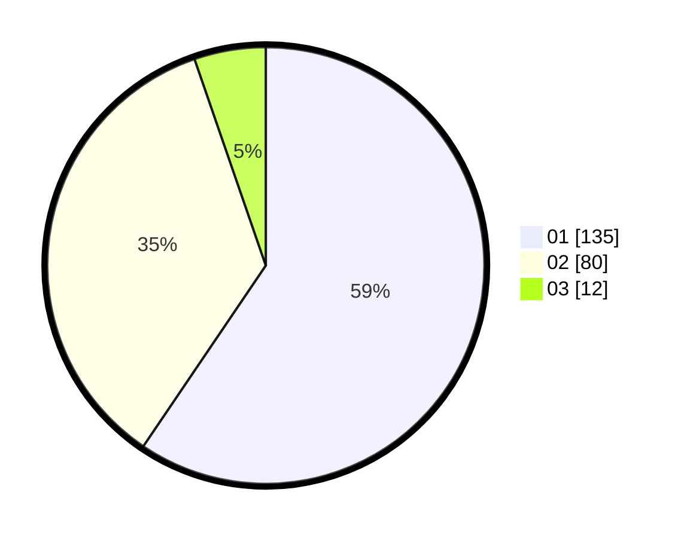

# Hasil

Hasil perolehan suara paslon dapat dilihat pada file paslon-01.txt, paslon-02.txt, dan paslon-03.txt.

Jika tidak ada, artinya data tersebut belum ada pada SIREKAP.

## Perolehan Suara

 * Paslon 01: **135**.
 * Paslon 02: **80**.
 * Paslon 03: **12**.

## Foto C Plano

https://sirekap-obj-formc.kpu.go.id/1dc2/pemilu/ppwp/31/73/06/10/02/3173061002097-20240215-000621--72e34cbe-f7f4-4a28-bb32-a2a6dcbe32ae.jpg

https://sirekap-obj-formc.kpu.go.id/1dc2/pemilu/ppwp/31/73/06/10/02/3173061002097-20240215-000753--591c12d8-4d0e-4181-8d22-fe06f780a4b6.jpg

https://sirekap-obj-formc.kpu.go.id/1dc2/pemilu/ppwp/31/73/06/10/02/3173061002097-20240215-000841--4d46577f-4a5c-4d2c-9075-74b1bd5dd9ae.jpg

## DATA PEMILIH TETAP

Jumlah pemilih dalam DPT: **259**.
 * L: **138**.
 * P: **121**.

## DATA PENGGUNA HAK PILIH

Jumlah pengguna hak pilih dalam DPT: **225**.
 * L: **117**.
 * P: **108**.

Jumlah pengguna hak pilih dalam DPTb: **3**.
 * L: **1**.
 * P: **2**.

Jumlah pengguna hak pilih dalam DPK: **3**.
 * L: **1**.
 * P: **2**.

Jumlah pengguna hak pilih: **231**.
 * L: **119**.
 * P: **112**.

## JUMLAH SUARA SAH DAN TIDAK SAH

JUMLAH SELURUH SUARA SAH: **227**.

JUMLAH SUARA TIDAK SAH: **4**.

JUMLAH SELURUH SUARA SAH DAN SUARA TIDAK SAH: **231**.
