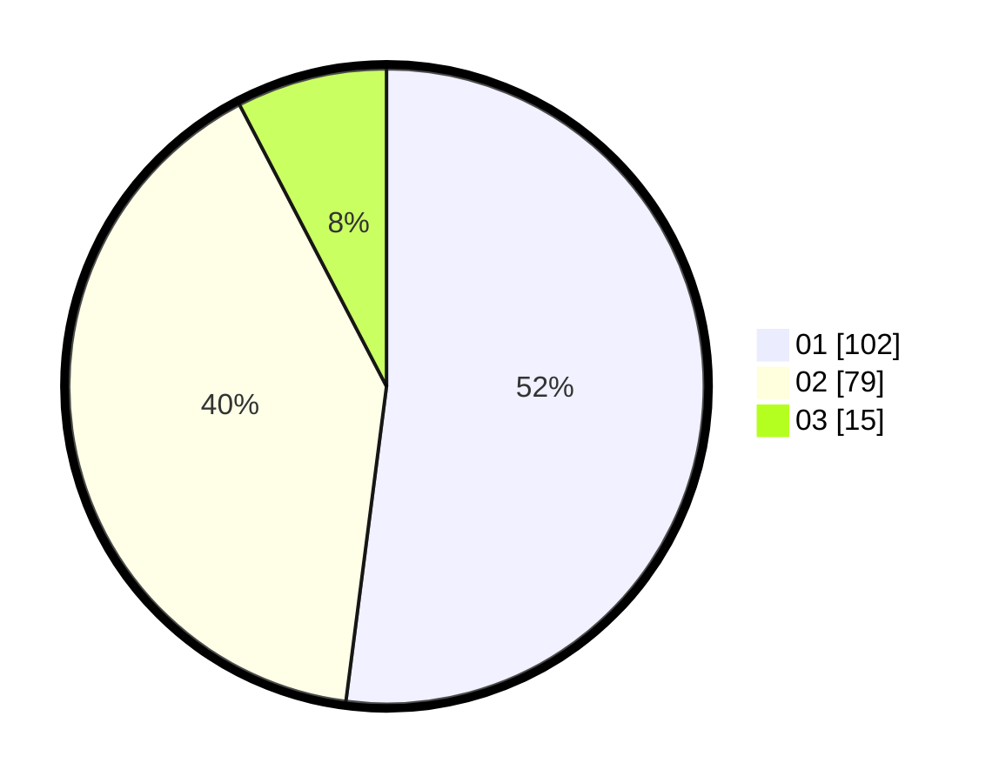

# Hasil

Hasil perolehan suara paslon dapat dilihat pada file paslon-01.txt, paslon-02.txt, dan paslon-03.txt.

Jika tidak ada, artinya data tersebut belum ada pada SIREKAP.

## Perolehan Suara

 * Paslon 01: **102**.
 * Paslon 02: **79**.
 * Paslon 03: **15**.

## Foto C Plano

https://sirekap-obj-formc.kpu.go.id/9f11/pemilu/ppwp/31/73/06/10/02/3173061002100-20240214-212627--101a93a6-d310-4754-ae74-46eac4a4712b.jpg

https://sirekap-obj-formc.kpu.go.id/9f11/pemilu/ppwp/31/73/06/10/02/3173061002100-20240214-213024--250d802d-8fd4-4901-8008-18fa08d49ac5.jpg

https://sirekap-obj-formc.kpu.go.id/9f11/pemilu/ppwp/31/73/06/10/02/3173061002100-20240214-213236--3ec532fc-3e99-4b6c-95f0-51e8feef7065.jpg
