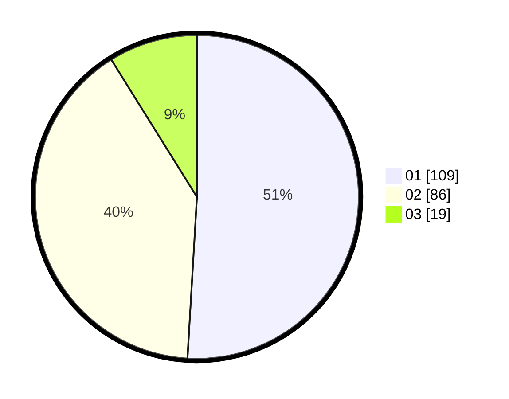

# Hasil

Hasil perolehan suara paslon dapat dilihat pada file paslon-01.txt, paslon-02.txt, dan paslon-03.txt.

Jika tidak ada, artinya data tersebut belum ada pada SIREKAP.

## Perolehan Suara

 * Paslon 01: **109**.
 * Paslon 02: **86**.
 * Paslon 03: **19**.

## Foto C Plano

https://sirekap-obj-formc.kpu.go.id/dfde/pemilu/ppwp/31/73/06/10/02/3173061002101-20240216-005433--8d5ffd33-dd4c-4e88-883d-a40a4516e889.jpg

https://sirekap-obj-formc.kpu.go.id/dfde/pemilu/ppwp/31/73/06/10/02/3173061002101-20240216-005444--07445834-9938-47f4-a1d3-4c38f06655f4.jpg

https://sirekap-obj-formc.kpu.go.id/dfde/pemilu/ppwp/31/73/06/10/02/3173061002101-20240216-005437--6c14f7ef-690d-47c7-99e5-a1a6876332c0.jpg

## DATA PEMILIH TETAP

Jumlah pemilih dalam DPT: **264**.
 * L: **128**.
 * P: **136**.

## DATA PENGGUNA HAK PILIH

Jumlah pengguna hak pilih dalam DPT: **214**.
 * L: **102**.
 * P: **112**.

Jumlah pengguna hak pilih dalam DPTb: **2**.
 * L: **0**.
 * P: **2**.

Jumlah pengguna hak pilih dalam DPK: **0**.
 * L: **0**.
 * P: **0**.

Jumlah pengguna hak pilih: **216**.
 * L: **102**.
 * P: **114**.

## JUMLAH SUARA SAH DAN TIDAK SAH

JUMLAH SELURUH SUARA SAH: **214**.

JUMLAH SUARA TIDAK SAH: **2**.

JUMLAH SELURUH SUARA SAH DAN SUARA TIDAK SAH: **216**.
