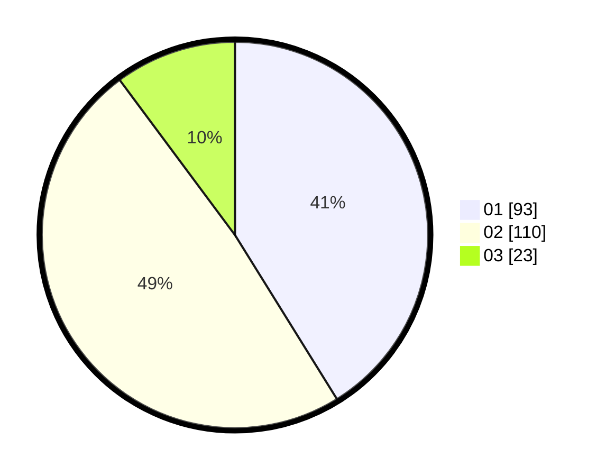

# Hasil

Hasil perolehan suara paslon dapat dilihat pada file paslon-01.txt, paslon-02.txt, dan paslon-03.txt.

Jika tidak ada, artinya data tersebut belum ada pada SIREKAP.

## Perolehan Suara

 * Paslon 01: **93**.
 * Paslon 02: **110**.
 * Paslon 03: **23**.

## Foto C Plano

https://sirekap-obj-formc.kpu.go.id/3aee/pemilu/ppwp/31/73/06/10/02/3173061002102-20240214-211821--0fbb603a-e740-46d5-9afa-7d78c82a8d76.jpg

https://sirekap-obj-formc.kpu.go.id/3aee/pemilu/ppwp/31/73/06/10/02/3173061002102-20240214-222245--c689e54e-666d-4a1f-887b-a8c9395af1a0.jpg

https://sirekap-obj-formc.kpu.go.id/3aee/pemilu/ppwp/31/73/06/10/02/3173061002102-20240214-211905--1edbd4cc-5a75-4284-afe2-d8bc1bc9d58f.jpg
