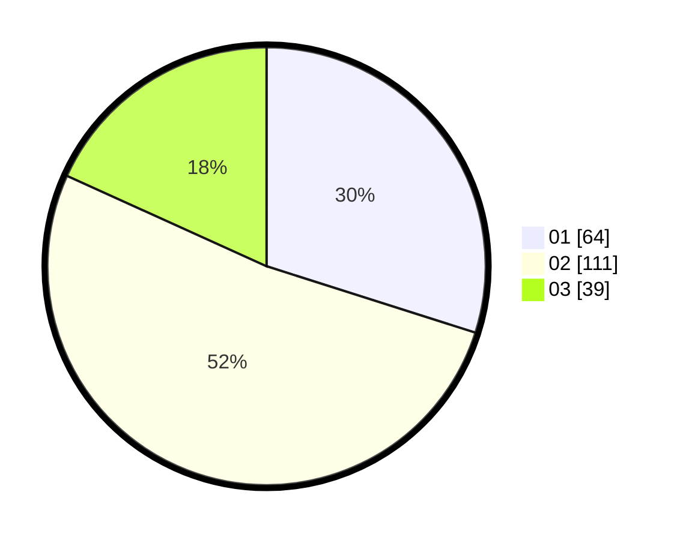

# Hasil

Hasil perolehan suara paslon dapat dilihat pada file paslon-01.txt, paslon-02.txt, dan paslon-03.txt.

Jika tidak ada, artinya data tersebut belum ada pada SIREKAP.

## Perolehan Suara

 * Paslon 01: **64**.
 * Paslon 02: **111**.
 * Paslon 03: **39**.

## Foto C Plano

https://sirekap-obj-formc.kpu.go.id/aa76/pemilu/ppwp/31/73/06/10/02/3173061002106-20240214-194633--d06aa752-53c0-4fe6-bbdb-fdf7c4609422.jpg

https://sirekap-obj-formc.kpu.go.id/aa76/pemilu/ppwp/31/73/06/10/02/3173061002106-20240214-200553--52818327-0314-4c2c-ae0e-ae79a8985293.jpg

https://sirekap-obj-formc.kpu.go.id/aa76/pemilu/ppwp/31/73/06/10/02/3173061002106-20240214-201653--c5fe3881-c84a-4ba5-b571-ce3b300f72b1.jpg

## DATA PEMILIH TETAP

Jumlah pemilih dalam DPT: **283**.
 * L: **138**.
 * P: **145**.

## DATA PENGGUNA HAK PILIH

Jumlah pengguna hak pilih dalam DPT: **214**.
 * L: **101**.
 * P: **113**.

Jumlah pengguna hak pilih dalam DPTb: **0**.
 * L: **0**.
 * P: **0**.

Jumlah pengguna hak pilih dalam DPK: **0**.
 * L: **0**.
 * P: **0**.

Jumlah pengguna hak pilih: **214**.
 * L: **101**.
 * P: **113**.

## JUMLAH SUARA SAH DAN TIDAK SAH

JUMLAH SELURUH SUARA SAH: **214**.

JUMLAH SUARA TIDAK SAH: **0**.

JUMLAH SELURUH SUARA SAH DAN SUARA TIDAK SAH: **214**.
