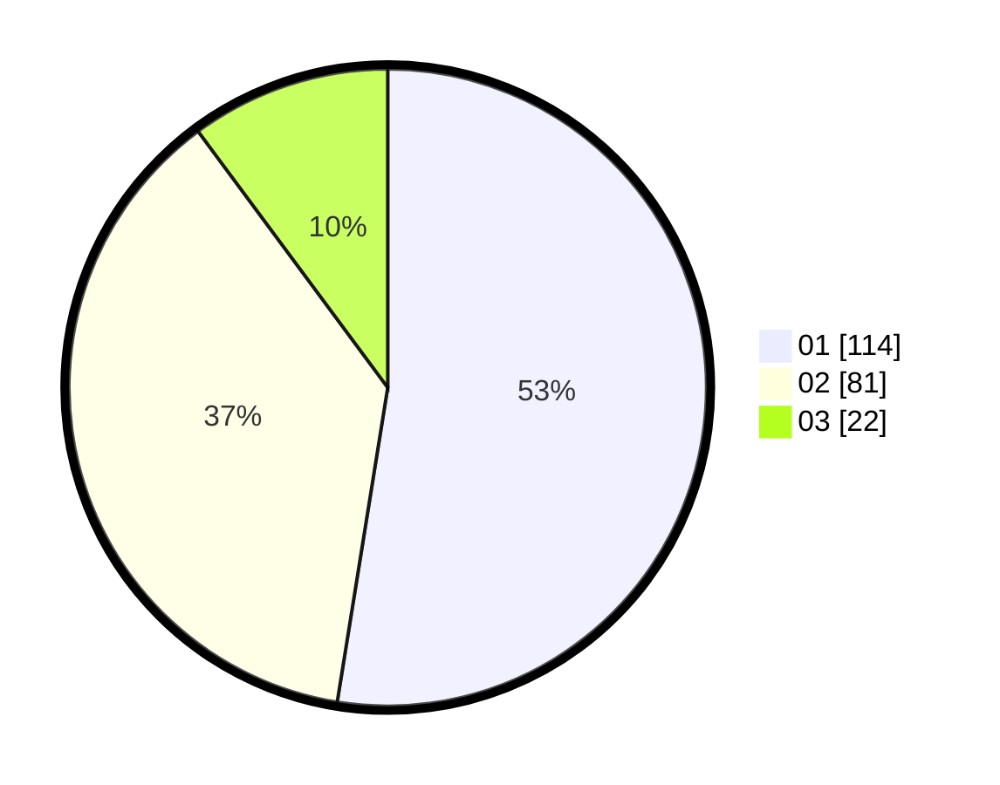

# Hasil

Hasil perolehan suara paslon dapat dilihat pada file paslon-01.txt, paslon-02.txt, dan paslon-03.txt.

Jika tidak ada, artinya data tersebut belum ada pada SIREKAP.

## Perolehan Suara

 * Paslon 01: **114**.
 * Paslon 02: **81**.
 * Paslon 03: **22**.

## Foto C Plano

https://sirekap-obj-formc.kpu.go.id/1233/pemilu/ppwp/31/73/06/10/02/3173061002107-20240214-195239--0c8b83b7-f08f-4fd8-904e-e94af5935bf9.jpg

https://sirekap-obj-formc.kpu.go.id/1233/pemilu/ppwp/31/73/06/10/02/3173061002107-20240215-230204--f887737b-44f8-45cc-9b7a-e22fd4a9b367.jpg

https://sirekap-obj-formc.kpu.go.id/1233/pemilu/ppwp/31/73/06/10/02/3173061002107-20240214-200113--c4c49cbb-4ea5-46e9-93e2-1470205e803f.jpg

## DATA PEMILIH TETAP

Jumlah pemilih dalam DPT: **271**.
 * L: **141**.
 * P: **130**.

## DATA PENGGUNA HAK PILIH

Jumlah pengguna hak pilih dalam DPT: **216**.
 * L: **103**.
 * P: **113**.

Jumlah pengguna hak pilih dalam DPTb: **0**.
 * L: **0**.
 * P: **0**.

Jumlah pengguna hak pilih dalam DPK: **5**.
 * L: **3**.
 * P: **2**.

Jumlah pengguna hak pilih: **221**.
 * L: **106**.
 * P: **115**.

## JUMLAH SUARA SAH DAN TIDAK SAH

JUMLAH SELURUH SUARA SAH: **217**.

JUMLAH SUARA TIDAK SAH: **4**.

JUMLAH SELURUH SUARA SAH DAN SUARA TIDAK SAH: **221**.
