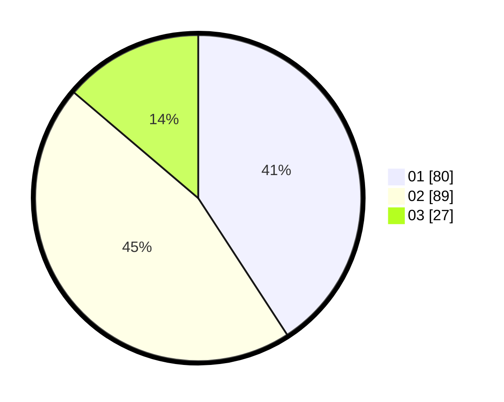

# Hasil

Hasil perolehan suara paslon dapat dilihat pada file paslon-01.txt, paslon-02.txt, dan paslon-03.txt.

Jika tidak ada, artinya data tersebut belum ada pada SIREKAP.

## Perolehan Suara

 * Paslon 01: **80**.
 * Paslon 02: **89**.
 * Paslon 03: **27**.

## Foto C Plano

https://sirekap-obj-formc.kpu.go.id/e056/pemilu/ppwp/31/73/06/10/02/3173061002108-20240214-193528--819e7c95-ea4e-4e3c-a290-dc548e05a191.jpg

https://sirekap-obj-formc.kpu.go.id/e056/pemilu/ppwp/31/73/06/10/02/3173061002108-20240214-194119--19139645-f5fb-4f3c-99b9-a4ce88f0dd75.jpg

https://sirekap-obj-formc.kpu.go.id/e056/pemilu/ppwp/31/73/06/10/02/3173061002108-20240214-194635--c293c938-9180-4a97-baa5-d1499d6912b2.jpg

## DATA PEMILIH TETAP

Jumlah pemilih dalam DPT: **271**.
 * L: **135**.
 * P: **136**.

## DATA PENGGUNA HAK PILIH

Jumlah pengguna hak pilih dalam DPT: **203**.
 * L: **97**.
 * P: **106**.

Jumlah pengguna hak pilih dalam DPTb: **1**.
 * L: **1**.
 * P: **0**.

Jumlah pengguna hak pilih dalam DPK: **2**.
 * L: **1**.
 * P: **1**.

Jumlah pengguna hak pilih: **206**.
 * L: **99**.
 * P: **107**.

## JUMLAH SUARA SAH DAN TIDAK SAH

JUMLAH SELURUH SUARA SAH: **196**.

JUMLAH SUARA TIDAK SAH: **10**.

JUMLAH SELURUH SUARA SAH DAN SUARA TIDAK SAH: **206**.
