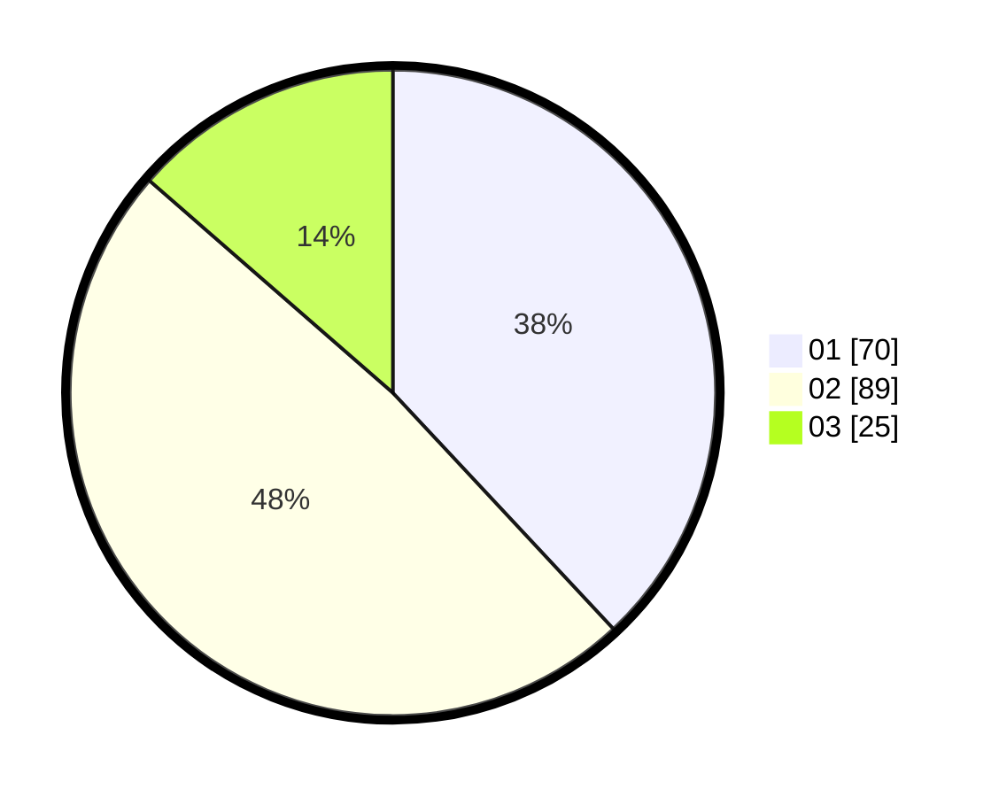

# Hasil

Hasil perolehan suara paslon dapat dilihat pada file paslon-01.txt, paslon-02.txt, dan paslon-03.txt.

Jika tidak ada, artinya data tersebut belum ada pada SIREKAP.

## Perolehan Suara

 * Paslon 01: **70**.
 * Paslon 02: **89**.
 * Paslon 03: **25**.

## Foto C Plano

https://sirekap-obj-formc.kpu.go.id/bbf9/pemilu/ppwp/31/73/06/10/02/3173061002109-20240214-203937--4b9fbf69-f643-486e-9d49-1105dd194f6c.jpg

https://sirekap-obj-formc.kpu.go.id/bbf9/pemilu/ppwp/31/73/06/10/02/3173061002109-20240214-234322--6b9aacb7-aaf5-4f15-be30-32f55f4fbd9a.jpg

https://sirekap-obj-formc.kpu.go.id/bbf9/pemilu/ppwp/31/73/06/10/02/3173061002109-20240214-204247--acb3fe6f-f961-4256-9050-d0047f066cc7.jpg

## DATA PEMILIH TETAP

Jumlah pemilih dalam DPT: **271**.
 * L: **142**.
 * P: **129**.

## DATA PENGGUNA HAK PILIH

Jumlah pengguna hak pilih dalam DPT: **186**.
 * L: **89**.
 * P: **97**.

Jumlah pengguna hak pilih dalam DPTb: **0**.
 * L: **0**.
 * P: **0**.

Jumlah pengguna hak pilih dalam DPK: **3**.
 * L: **2**.
 * P: **1**.

Jumlah pengguna hak pilih: **189**.
 * L: **91**.
 * P: **98**.

## JUMLAH SUARA SAH DAN TIDAK SAH

JUMLAH SELURUH SUARA SAH: **184**.

JUMLAH SUARA TIDAK SAH: **5**.

JUMLAH SELURUH SUARA SAH DAN SUARA TIDAK SAH: **189**.
