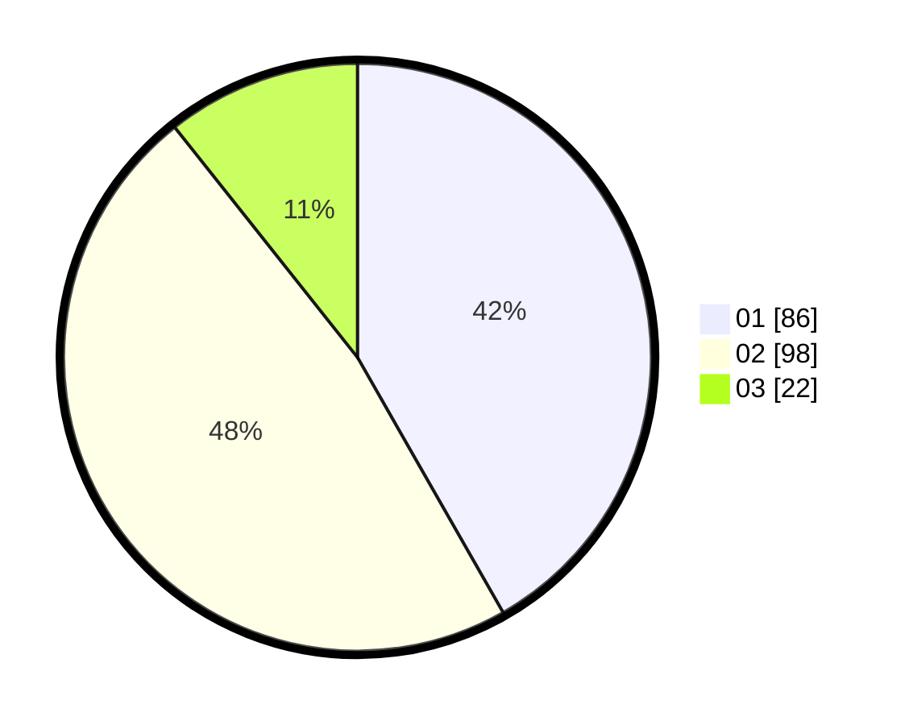

# Hasil

Hasil perolehan suara paslon dapat dilihat pada file paslon-01.txt, paslon-02.txt, dan paslon-03.txt.

Jika tidak ada, artinya data tersebut belum ada pada SIREKAP.

## Perolehan Suara

 * Paslon 01: **86**.
 * Paslon 02: **98**.
 * Paslon 03: **22**.

## Foto C Plano

https://sirekap-obj-formc.kpu.go.id/7ea3/pemilu/ppwp/31/73/06/10/02/3173061002111-20240214-160133--ec7784fa-a087-4857-b96e-414b619d7afe.jpg

https://sirekap-obj-formc.kpu.go.id/7ea3/pemilu/ppwp/31/73/06/10/02/3173061002111-20240215-123507--324316de-25b0-42c7-a3f3-2b84c5427865.jpg

https://sirekap-obj-formc.kpu.go.id/7ea3/pemilu/ppwp/31/73/06/10/02/3173061002111-20240215-123453--15054839-e4fe-4b5e-86d2-671857bdda9e.jpg

## DATA PEMILIH TETAP

Jumlah pemilih dalam DPT: **268**.
 * L: **134**.
 * P: **134**.

## DATA PENGGUNA HAK PILIH

Jumlah pengguna hak pilih dalam DPT: **206**.
 * L: **100**.
 * P: **106**.

Jumlah pengguna hak pilih dalam DPTb: **0**.
 * L: **0**.
 * P: **0**.

Jumlah pengguna hak pilih dalam DPK: **2**.
 * L: **1**.
 * P: **1**.

Jumlah pengguna hak pilih: **208**.
 * L: **101**.
 * P: **107**.

## JUMLAH SUARA SAH DAN TIDAK SAH

JUMLAH SELURUH SUARA SAH: **206**.

JUMLAH SUARA TIDAK SAH: **2**.

JUMLAH SELURUH SUARA SAH DAN SUARA TIDAK SAH: **208**.
