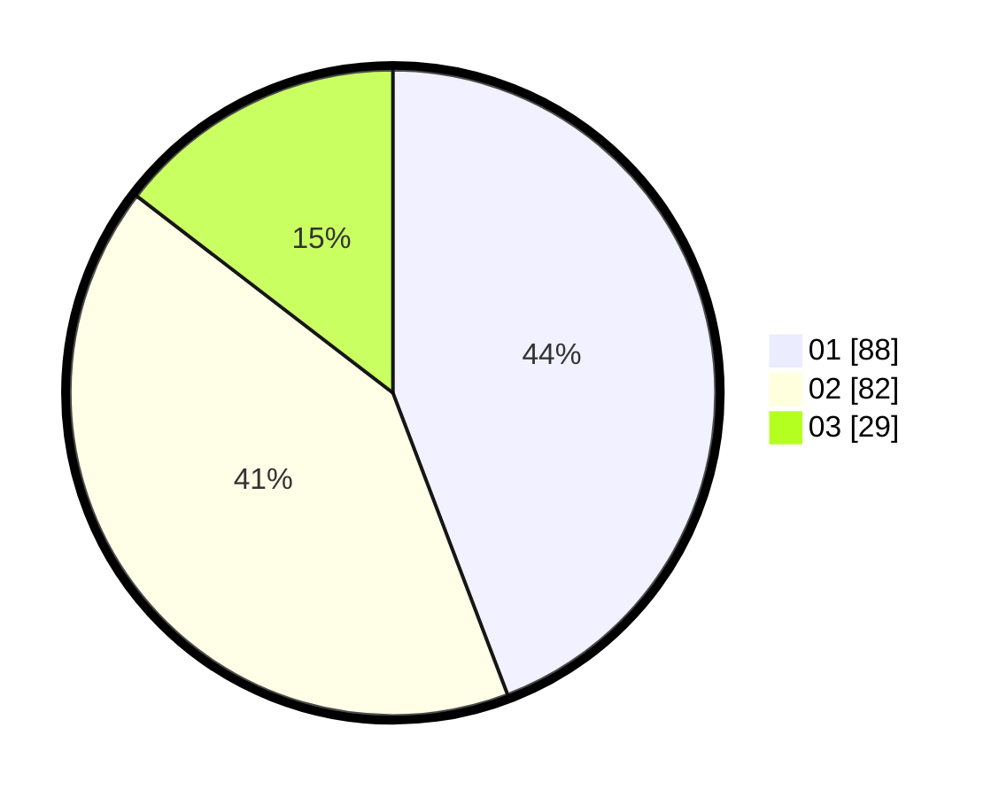

# Hasil

Hasil perolehan suara paslon dapat dilihat pada file paslon-01.txt, paslon-02.txt, dan paslon-03.txt.

Jika tidak ada, artinya data tersebut belum ada pada SIREKAP.

## Perolehan Suara

 * Paslon 01: **88**.
 * Paslon 02: **82**.
 * Paslon 03: **29**.

## Foto C Plano

https://sirekap-obj-formc.kpu.go.id/f172/pemilu/ppwp/31/73/06/10/02/3173061002112-20240214-184617--b72fa4c5-f2c4-4b22-9edd-e9a122651e2f.jpg

https://sirekap-obj-formc.kpu.go.id/f172/pemilu/ppwp/31/73/06/10/02/3173061002112-20240215-182415--057a7ac6-845d-4b96-b40d-c06e323ffa77.jpg

https://sirekap-obj-formc.kpu.go.id/f172/pemilu/ppwp/31/73/06/10/02/3173061002112-20240215-182404--9f8fbd9a-1486-4325-a4b3-e9e151cbf3c3.jpg

## DATA PEMILIH TETAP

Jumlah pemilih dalam DPT: **270**.
 * L: **147**.
 * P: **123**.

## DATA PENGGUNA HAK PILIH

Jumlah pengguna hak pilih dalam DPT: **199**.
 * L: **106**.
 * P: **93**.

Jumlah pengguna hak pilih dalam DPTb: **0**.
 * L: **0**.
 * P: **0**.

Jumlah pengguna hak pilih dalam DPK: **3**.
 * L: **1**.
 * P: **2**.

Jumlah pengguna hak pilih: **202**.
 * L: **107**.
 * P: **95**.

## JUMLAH SUARA SAH DAN TIDAK SAH

JUMLAH SELURUH SUARA SAH: **199**.

JUMLAH SUARA TIDAK SAH: **3**.

JUMLAH SELURUH SUARA SAH DAN SUARA TIDAK SAH: **202**.
