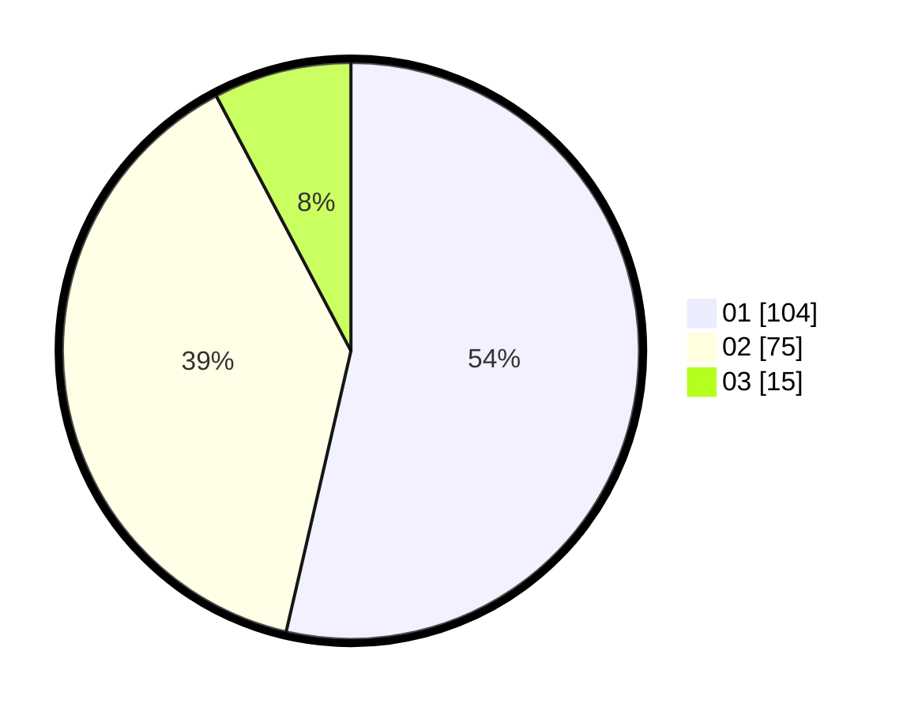

# Hasil

Hasil perolehan suara paslon dapat dilihat pada file paslon-01.txt, paslon-02.txt, dan paslon-03.txt.

Jika tidak ada, artinya data tersebut belum ada pada SIREKAP.

## Perolehan Suara

 * Paslon 01: **104**.
 * Paslon 02: **75**.
 * Paslon 03: **15**.

## Foto C Plano

https://sirekap-obj-formc.kpu.go.id/5d9b/pemilu/ppwp/31/73/06/10/02/3173061002114-20240214-210323--f945b943-c069-4493-a9f1-4a69e9bc355e.jpg

https://sirekap-obj-formc.kpu.go.id/5d9b/pemilu/ppwp/31/73/06/10/02/3173061002114-20240214-210423--6b01e866-f1e1-4e0a-973c-67663756200b.jpg

https://sirekap-obj-formc.kpu.go.id/5d9b/pemilu/ppwp/31/73/06/10/02/3173061002114-20240214-210516--723635e7-9d02-4441-adfa-64c73c70b788.jpg

## DATA PEMILIH TETAP

Jumlah pemilih dalam DPT: **259**.
 * L: **137**.
 * P: **172**.

## DATA PENGGUNA HAK PILIH

Jumlah pengguna hak pilih dalam DPT: **257**.
 * L: **125**.
 * P: **171**.

Jumlah pengguna hak pilih dalam DPTb: **0**.
 * L: **0**.
 * P: **0**.

Jumlah pengguna hak pilih dalam DPK: **8**.
 * L: **2**.
 * P: **6**.

Jumlah pengguna hak pilih: **275**.
 * L: **738**.
 * P: **177**.

## JUMLAH SUARA SAH DAN TIDAK SAH

JUMLAH SELURUH SUARA SAH: **215**.

JUMLAH SUARA TIDAK SAH: **2**.

JUMLAH SELURUH SUARA SAH DAN SUARA TIDAK SAH: **217**.
