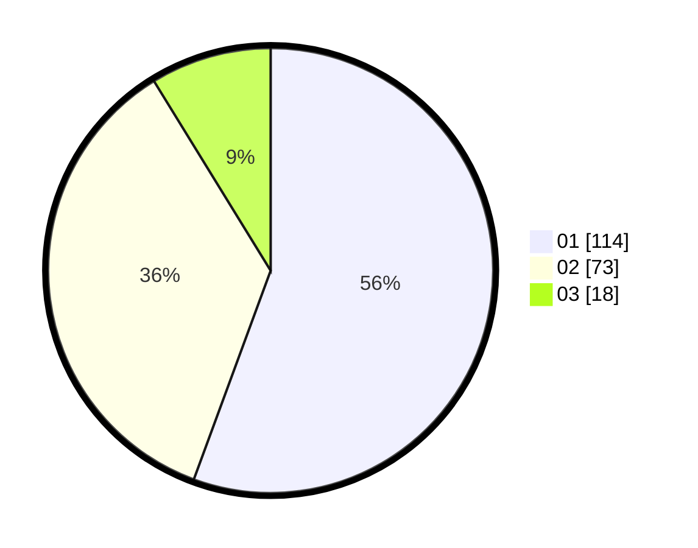

# Hasil

Hasil perolehan suara paslon dapat dilihat pada file paslon-01.txt, paslon-02.txt, dan paslon-03.txt.

Jika tidak ada, artinya data tersebut belum ada pada SIREKAP.

## Perolehan Suara

 * Paslon 01: **114**.
 * Paslon 02: **73**.
 * Paslon 03: **18**.

## Foto C Plano

https://sirekap-obj-formc.kpu.go.id/a874/pemilu/ppwp/31/73/06/10/02/3173061002115-20240216-015329--0de9444c-2eea-460a-aeaf-940e75b9c78e.jpg

https://sirekap-obj-formc.kpu.go.id/a874/pemilu/ppwp/31/73/06/10/02/3173061002115-20240216-015331--2254fc00-6425-4f02-a2d1-5a9e2a8a3090.jpg

https://sirekap-obj-formc.kpu.go.id/a874/pemilu/ppwp/31/73/06/10/02/3173061002115-20240216-015329--43274d66-16d7-4d4a-abf7-ea03379cc101.jpg

## DATA PEMILIH TETAP

Jumlah pemilih dalam DPT: **268**.
 * L: **137**.
 * P: **131**.

## DATA PENGGUNA HAK PILIH

Jumlah pengguna hak pilih dalam DPT: **207**.
 * L: **104**.
 * P: **103**.

Jumlah pengguna hak pilih dalam DPTb: **0**.
 * L: **0**.
 * P: **0**.

Jumlah pengguna hak pilih dalam DPK: **0**.
 * L: **0**.
 * P: **0**.

Jumlah pengguna hak pilih: **207**.
 * L: **104**.
 * P: **103**.

## JUMLAH SUARA SAH DAN TIDAK SAH

JUMLAH SELURUH SUARA SAH: **205**.

JUMLAH SUARA TIDAK SAH: **2**.

JUMLAH SELURUH SUARA SAH DAN SUARA TIDAK SAH: **207**.
