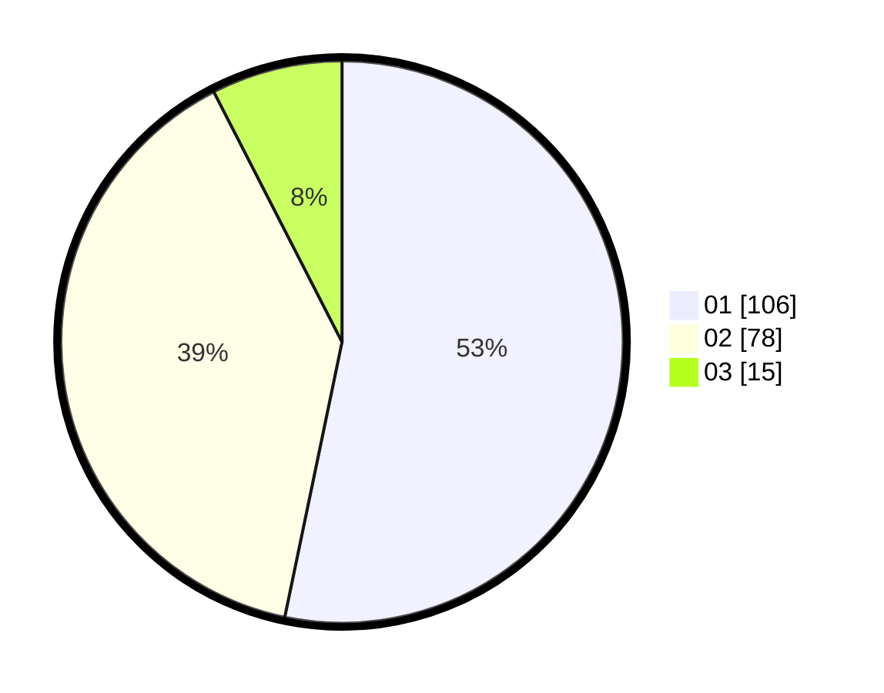

# Hasil

Hasil perolehan suara paslon dapat dilihat pada file paslon-01.txt, paslon-02.txt, dan paslon-03.txt.

Jika tidak ada, artinya data tersebut belum ada pada SIREKAP.

## Perolehan Suara

 * Paslon 01: **106**.
 * Paslon 02: **78**.
 * Paslon 03: **15**.

## Foto C Plano

https://sirekap-obj-formc.kpu.go.id/a32d/pemilu/ppwp/31/73/06/10/02/3173061002116-20240214-190008--6eceb240-fe00-44ec-a850-84b4ef33a525.jpg

https://sirekap-obj-formc.kpu.go.id/a32d/pemilu/ppwp/31/73/06/10/02/3173061002116-20240214-214206--5241f2f8-197b-42bc-b8db-fa2ff71e61c9.jpg

https://sirekap-obj-formc.kpu.go.id/a32d/pemilu/ppwp/31/73/06/10/02/3173061002116-20240214-214321--32bcb717-4c26-43f2-bf3f-76bf81bd6648.jpg

## DATA PEMILIH TETAP

Jumlah pemilih dalam DPT: **201**.
 * L: **99**.
 * P: **102**.

## DATA PENGGUNA HAK PILIH

Jumlah pengguna hak pilih dalam DPT: **201**.
 * L: **99**.
 * P: **102**.

Jumlah pengguna hak pilih dalam DPTb: **0**.
 * L: **0**.
 * P: **0**.

Jumlah pengguna hak pilih dalam DPK: **1**.
 * L: **1**.
 * P: **0**.

Jumlah pengguna hak pilih: **202**.
 * L: **100**.
 * P: **102**.

## JUMLAH SUARA SAH DAN TIDAK SAH

JUMLAH SELURUH SUARA SAH: **199**.

JUMLAH SUARA TIDAK SAH: **3**.

JUMLAH SELURUH SUARA SAH DAN SUARA TIDAK SAH: **202**.
