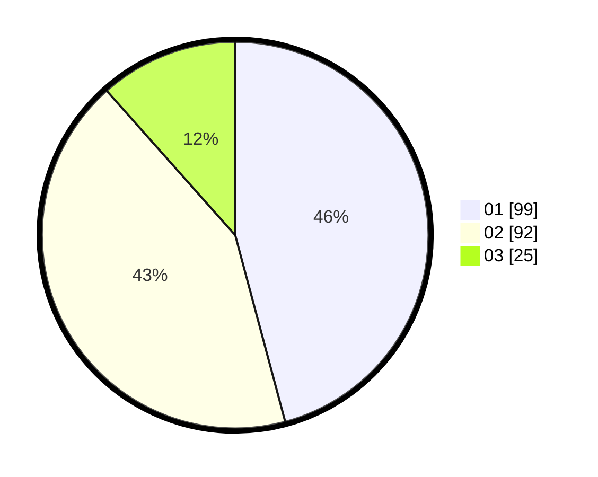

# Hasil

Hasil perolehan suara paslon dapat dilihat pada file paslon-01.txt, paslon-02.txt, dan paslon-03.txt.

Jika tidak ada, artinya data tersebut belum ada pada SIREKAP.

## Perolehan Suara

 * Paslon 01: **99**.
 * Paslon 02: **92**.
 * Paslon 03: **25**.

## Foto C Plano

https://sirekap-obj-formc.kpu.go.id/7bde/pemilu/ppwp/31/73/06/10/02/3173061002118-20240216-074111--993f8c4f-6acf-4d93-b4f2-ea8c03fbc59e.jpg

https://sirekap-obj-formc.kpu.go.id/7bde/pemilu/ppwp/31/73/06/10/02/3173061002118-20240216-074131--2d020fee-66cb-4acf-ae2f-556a0ea1b56f.jpg

https://sirekap-obj-formc.kpu.go.id/7bde/pemilu/ppwp/31/73/06/10/02/3173061002118-20240216-125432--07a3146e-7d2a-4d45-a4c8-6ba6213b9381.jpg

## DATA PEMILIH TETAP

Jumlah pemilih dalam DPT: **271**.
 * L: **133**.
 * P: **138**.

## DATA PENGGUNA HAK PILIH

Jumlah pengguna hak pilih dalam DPT: **222**.
 * L: **107**.
 * P: **115**.

Jumlah pengguna hak pilih dalam DPTb: **0**.
 * L: **0**.
 * P: **0**.

Jumlah pengguna hak pilih dalam DPK: **0**.
 * L: **0**.
 * P: **0**.

Jumlah pengguna hak pilih: **222**.
 * L: **107**.
 * P: **115**.

## JUMLAH SUARA SAH DAN TIDAK SAH

JUMLAH SELURUH SUARA SAH: **216**.

JUMLAH SUARA TIDAK SAH: **6**.

JUMLAH SELURUH SUARA SAH DAN SUARA TIDAK SAH: **222**.
