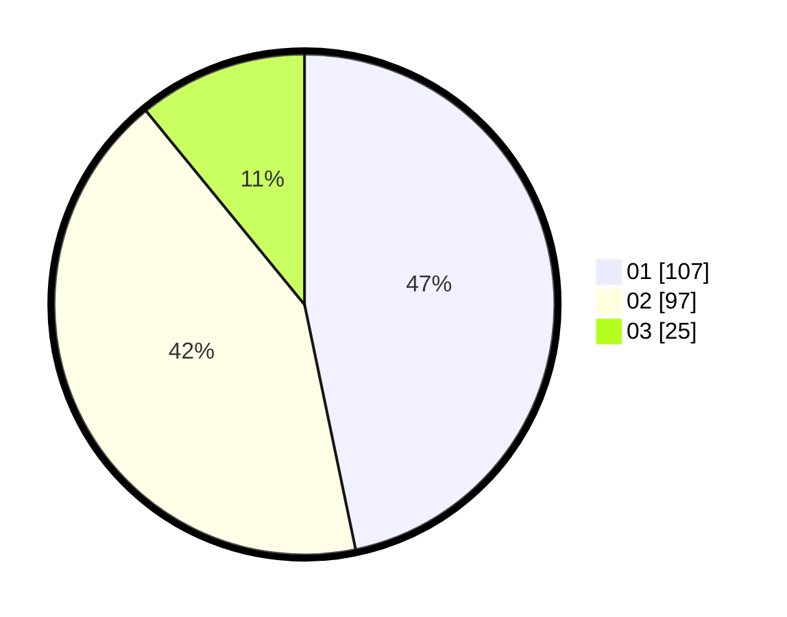

# Hasil

Hasil perolehan suara paslon dapat dilihat pada file paslon-01.txt, paslon-02.txt, dan paslon-03.txt.

Jika tidak ada, artinya data tersebut belum ada pada SIREKAP.

## Perolehan Suara

 * Paslon 01: **107**.
 * Paslon 02: **97**.
 * Paslon 03: **25**.

## Foto C Plano

https://sirekap-obj-formc.kpu.go.id/64f0/pemilu/ppwp/31/73/06/10/02/3173061002121-20240214-223923--7c2e4fc8-b1d5-4138-96db-7b558d0e667c.jpg

https://sirekap-obj-formc.kpu.go.id/64f0/pemilu/ppwp/31/73/06/10/02/3173061002121-20240214-210043--86380389-a4a8-42cd-99e9-7d1799539964.jpg

https://sirekap-obj-formc.kpu.go.id/64f0/pemilu/ppwp/31/73/06/10/02/3173061002121-20240214-212133--b35ecc00-4442-46d1-9484-71a71787e4d4.jpg
