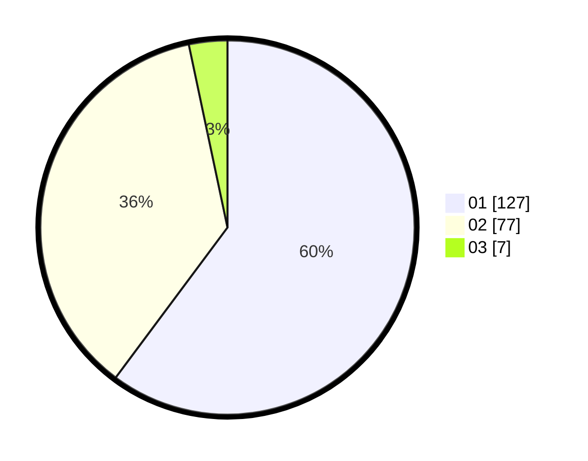

# Hasil

Hasil perolehan suara paslon dapat dilihat pada file paslon-01.txt, paslon-02.txt, dan paslon-03.txt.

Jika tidak ada, artinya data tersebut belum ada pada SIREKAP.

## Perolehan Suara

 * Paslon 01: **127**.
 * Paslon 02: **77**.
 * Paslon 03: **7**.

## Foto C Plano

https://sirekap-obj-formc.kpu.go.id/2925/pemilu/ppwp/31/73/06/10/02/3173061002124-20240215-022941--e7b9a384-28ce-4022-bc77-202143300d19.jpg

https://sirekap-obj-formc.kpu.go.id/2925/pemilu/ppwp/31/73/06/10/02/3173061002124-20240215-030338--f3b3e1ac-0f23-4da2-bbe9-5b3c9ae3548a.jpg
