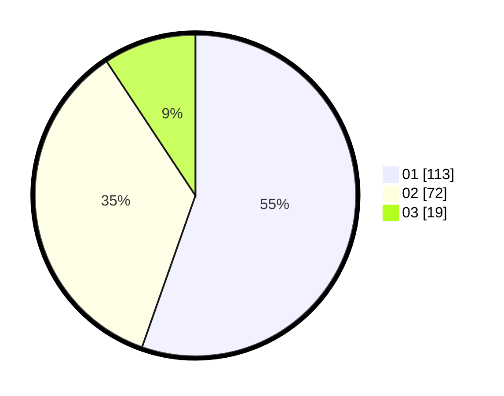

# Hasil

Hasil perolehan suara paslon dapat dilihat pada file paslon-01.txt, paslon-02.txt, dan paslon-03.txt.

Jika tidak ada, artinya data tersebut belum ada pada SIREKAP.

## Perolehan Suara

 * Paslon 01: **113**.
 * Paslon 02: **72**.
 * Paslon 03: **19**.

## Foto C Plano

https://sirekap-obj-formc.kpu.go.id/7fcb/pemilu/ppwp/31/73/06/10/02/3173061002125-20240215-043153--113216c0-82d4-4d2e-bd24-b75347f68bc6.jpg

https://sirekap-obj-formc.kpu.go.id/7fcb/pemilu/ppwp/31/73/06/10/02/3173061002125-20240215-043242--f54c0ccf-f18a-4bda-909b-ee21ae8d3ab7.jpg

https://sirekap-obj-formc.kpu.go.id/7fcb/pemilu/ppwp/31/73/06/10/02/3173061002125-20240215-043602--e4ad621d-a3a9-4de0-b082-40b4f7d49405.jpg
