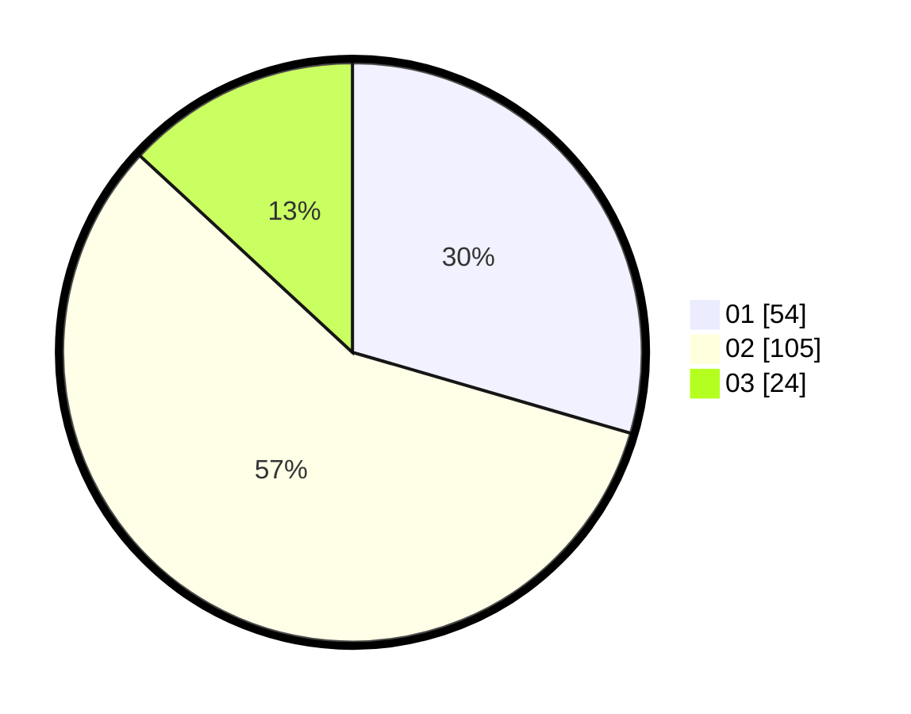

# Hasil

Hasil perolehan suara paslon dapat dilihat pada file paslon-01.txt, paslon-02.txt, dan paslon-03.txt.

Jika tidak ada, artinya data tersebut belum ada pada SIREKAP.

## Perolehan Suara

 * Paslon 01: **54**.
 * Paslon 02: **105**.
 * Paslon 03: **24**.

## Foto C Plano

https://sirekap-obj-formc.kpu.go.id/6b2d/pemilu/ppwp/31/73/06/10/02/3173061002131-20240214-222426--9fb2cf70-23e5-4871-bb74-fd6758f46731.jpg

https://sirekap-obj-formc.kpu.go.id/6b2d/pemilu/ppwp/31/73/06/10/02/3173061002131-20240214-231123--65610fff-8e26-4738-a23c-369b408ed1fe.jpg

https://sirekap-obj-formc.kpu.go.id/6b2d/pemilu/ppwp/31/73/06/10/02/3173061002131-20240214-222643--11d09678-99bc-482b-ae10-96a6fdfd2553.jpg
