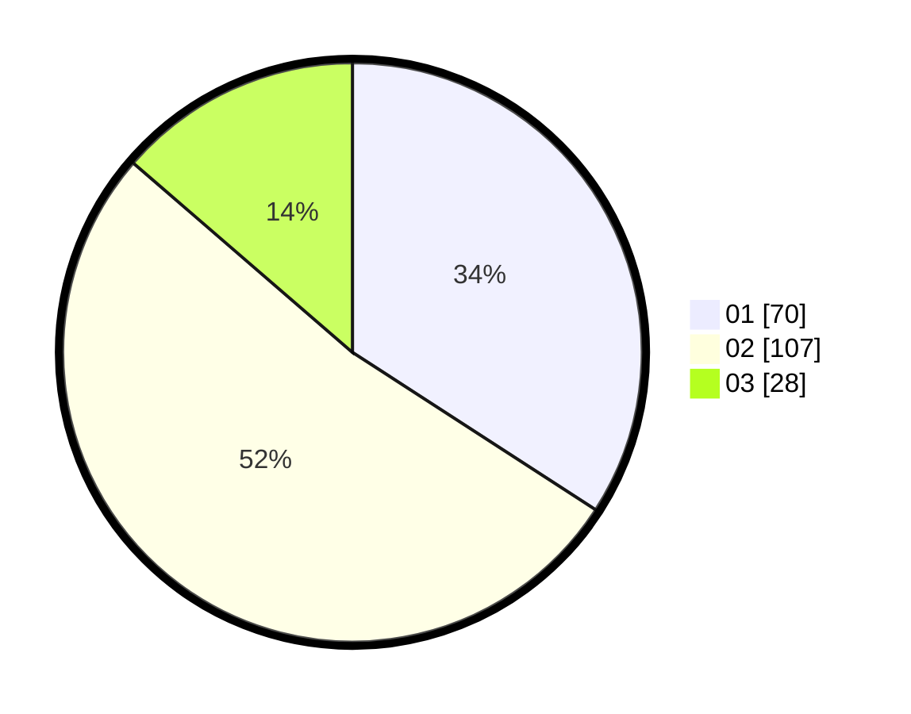

# Hasil

Hasil perolehan suara paslon dapat dilihat pada file paslon-01.txt, paslon-02.txt, dan paslon-03.txt.

Jika tidak ada, artinya data tersebut belum ada pada SIREKAP.

## Perolehan Suara

 * Paslon 01: **70**.
 * Paslon 02: **107**.
 * Paslon 03: **28**.

## Foto C Plano

https://sirekap-obj-formc.kpu.go.id/7b16/pemilu/ppwp/31/73/06/10/02/3173061002132-20240215-031003--a08a4614-6d4c-443e-964c-307c36100728.jpg

https://sirekap-obj-formc.kpu.go.id/7b16/pemilu/ppwp/31/73/06/10/02/3173061002132-20240215-003001--204ef20e-852e-4ce9-bb99-22cbecf523e5.jpg

https://sirekap-obj-formc.kpu.go.id/7b16/pemilu/ppwp/31/73/06/10/02/3173061002132-20240215-031717--19235da7-77b3-484e-b61d-1b77e004ba0a.jpg
