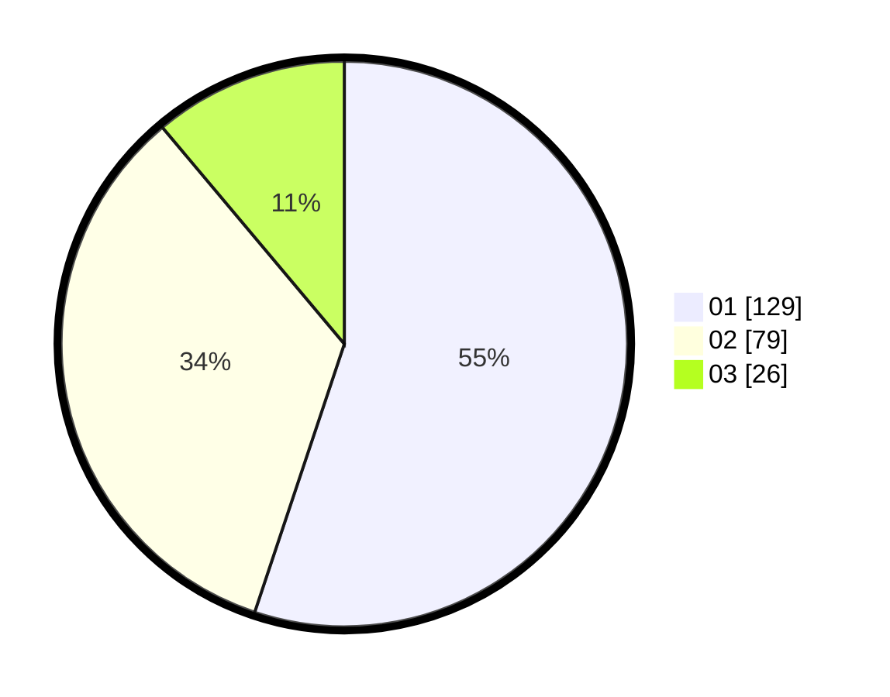

# Hasil

Hasil perolehan suara paslon dapat dilihat pada file paslon-01.txt, paslon-02.txt, dan paslon-03.txt.

Jika tidak ada, artinya data tersebut belum ada pada SIREKAP.

## Perolehan Suara

 * Paslon 01: **129**.
 * Paslon 02: **79**.
 * Paslon 03: **26**.

## Foto C Plano

https://sirekap-obj-formc.kpu.go.id/b1f1/pemilu/ppwp/31/73/06/10/02/3173061002143-20240214-210359--c6405439-dcce-4aa0-92c7-900ace459964.jpg

https://sirekap-obj-formc.kpu.go.id/b1f1/pemilu/ppwp/31/73/06/10/02/3173061002143-20240214-204437--a8c01c37-51fe-4703-aa4e-61a648ec738c.jpg

https://sirekap-obj-formc.kpu.go.id/b1f1/pemilu/ppwp/31/73/06/10/02/3173061002143-20240214-193308--c129cab8-3e52-4829-bf29-b9e2257b5b70.jpg
