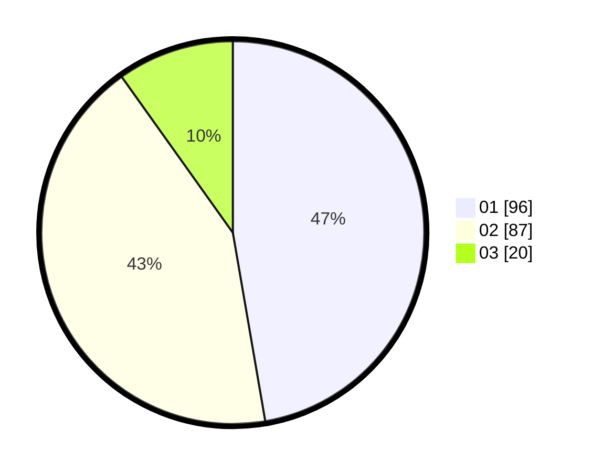

# Hasil

Hasil perolehan suara paslon dapat dilihat pada file paslon-01.txt, paslon-02.txt, dan paslon-03.txt.

Jika tidak ada, artinya data tersebut belum ada pada SIREKAP.

## Perolehan Suara

 * Paslon 01: **96**.
 * Paslon 02: **87**.
 * Paslon 03: **20**.

## Foto C Plano

https://sirekap-obj-formc.kpu.go.id/f84f/pemilu/ppwp/31/73/06/10/02/3173061002145-20240214-190900--27af4d74-a0da-46d1-a2a8-049fbfc7af8e.jpg

https://sirekap-obj-formc.kpu.go.id/f84f/pemilu/ppwp/31/73/06/10/02/3173061002145-20240214-204503--d4100f7c-e23e-41a7-918c-2f18fa0e77e6.jpg

https://sirekap-obj-formc.kpu.go.id/f84f/pemilu/ppwp/31/73/06/10/02/3173061002145-20240214-191248--cbeb8fb2-b15c-413c-a0da-b74cc7da5173.jpg

## DATA PEMILIH TETAP

Jumlah pemilih dalam DPT: **275**.
 * L: **132**.
 * P: **143**.

## DATA PENGGUNA HAK PILIH

Jumlah pengguna hak pilih dalam DPT: **206**.
 * L: **95**.
 * P: **111**.

Jumlah pengguna hak pilih dalam DPTb: **4**.
 * L: **2**.
 * P: **2**.

Jumlah pengguna hak pilih dalam DPK: **0**.
 * L: **0**.
 * P: **0**.

Jumlah pengguna hak pilih: **210**.
 * L: **97**.
 * P: **113**.

## JUMLAH SUARA SAH DAN TIDAK SAH

JUMLAH SELURUH SUARA SAH: **203**.

JUMLAH SUARA TIDAK SAH: **7**.

JUMLAH SELURUH SUARA SAH DAN SUARA TIDAK SAH: **210**.
