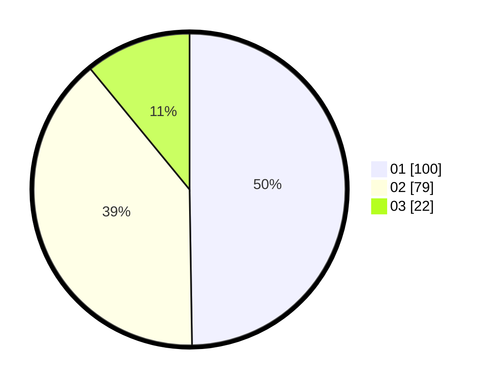

# Hasil

Hasil perolehan suara paslon dapat dilihat pada file paslon-01.txt, paslon-02.txt, dan paslon-03.txt.

Jika tidak ada, artinya data tersebut belum ada pada SIREKAP.

## Perolehan Suara

 * Paslon 01: **100**.
 * Paslon 02: **79**.
 * Paslon 03: **22**.

## Foto C Plano

https://sirekap-obj-formc.kpu.go.id/6ca4/pemilu/ppwp/31/73/06/10/02/3173061002146-20240214-221300--3fb8d98e-e9a1-4c98-a66f-bbf07bbf9dec.jpg

https://sirekap-obj-formc.kpu.go.id/6ca4/pemilu/ppwp/31/73/06/10/02/3173061002146-20240214-220741--7d291e5a-4c2a-4b1f-a1f9-0e8f855dc3d8.jpg

https://sirekap-obj-formc.kpu.go.id/6ca4/pemilu/ppwp/31/73/06/10/02/3173061002146-20240214-220414--d88cf10f-3a7c-4844-8311-429bdb07240d.jpg
