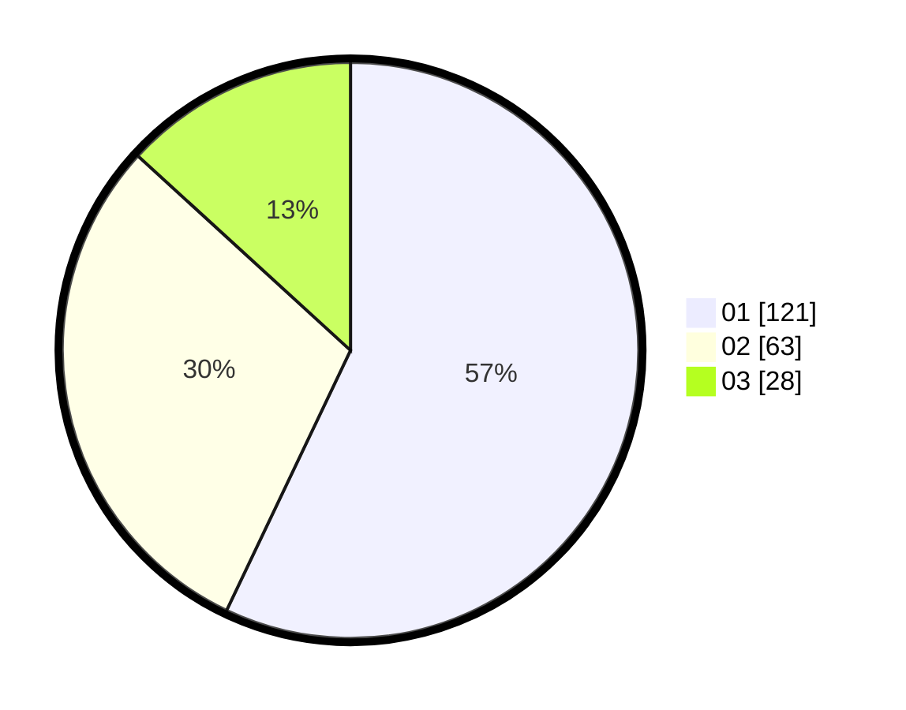

# Hasil

Hasil perolehan suara paslon dapat dilihat pada file paslon-01.txt, paslon-02.txt, dan paslon-03.txt.

Jika tidak ada, artinya data tersebut belum ada pada SIREKAP.

## Perolehan Suara

 * Paslon 01: **121**.
 * Paslon 02: **63**.
 * Paslon 03: **28**.

## Foto C Plano

https://sirekap-obj-formc.kpu.go.id/6251/pemilu/ppwp/31/73/06/10/02/3173061002148-20240216-035019--33165e72-d7e5-471b-9544-f3c6cc7785d3.jpg

https://sirekap-obj-formc.kpu.go.id/6251/pemilu/ppwp/31/73/06/10/02/3173061002148-20240216-035021--55b8c4b5-c8f0-4e42-b481-b8faac25af51.jpg

https://sirekap-obj-formc.kpu.go.id/6251/pemilu/ppwp/31/73/06/10/02/3173061002148-20240216-035020--deacd942-0a87-430f-9c43-3c48cc4acf16.jpg

## DATA PEMILIH TETAP

Jumlah pemilih dalam DPT: **275**.
 * L: **129**.
 * P: **146**.

## DATA PENGGUNA HAK PILIH

Jumlah pengguna hak pilih dalam DPT: **215**.
 * L: **102**.
 * P: **113**.

Jumlah pengguna hak pilih dalam DPTb: **0**.
 * L: **0**.
 * P: **0**.

Jumlah pengguna hak pilih dalam DPK: **0**.
 * L: **0**.
 * P: **0**.

Jumlah pengguna hak pilih: **215**.
 * L: **102**.
 * P: **113**.

## JUMLAH SUARA SAH DAN TIDAK SAH

JUMLAH SELURUH SUARA SAH: **212**.

JUMLAH SUARA TIDAK SAH: **3**.

JUMLAH SELURUH SUARA SAH DAN SUARA TIDAK SAH: **215**.
