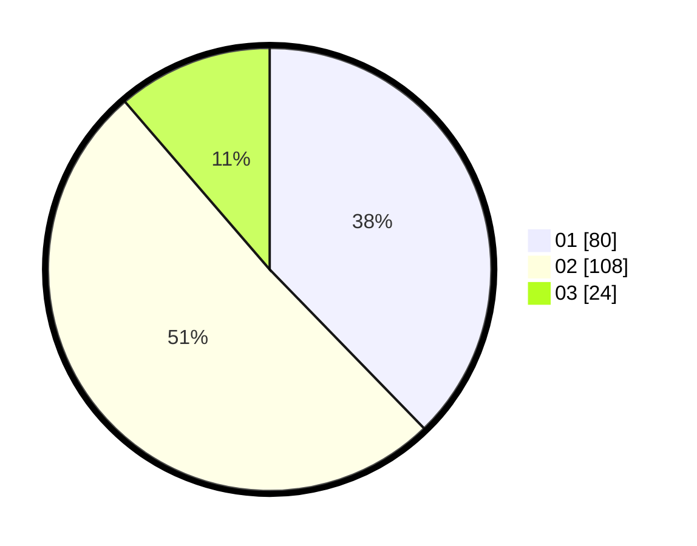

# Hasil

Hasil perolehan suara paslon dapat dilihat pada file paslon-01.txt, paslon-02.txt, dan paslon-03.txt.

Jika tidak ada, artinya data tersebut belum ada pada SIREKAP.

## Perolehan Suara

 * Paslon 01: **80**.
 * Paslon 02: **108**.
 * Paslon 03: **24**.

## Foto C Plano

https://sirekap-obj-formc.kpu.go.id/0209/pemilu/ppwp/31/73/06/10/02/3173061002154-20240214-204926--af39242b-c70c-40a7-9648-680fed83911d.jpg

https://sirekap-obj-formc.kpu.go.id/0209/pemilu/ppwp/31/73/06/10/02/3173061002154-20240214-205201--cf40551c-d630-48d4-9896-66d6c4fc356d.jpg

https://sirekap-obj-formc.kpu.go.id/0209/pemilu/ppwp/31/73/06/10/02/3173061002154-20240214-195430--5a32392e-cee7-4836-9e70-1e8dedee6e35.jpg

## DATA PEMILIH TETAP

Jumlah pemilih dalam DPT: **286**.
 * L: **145**.
 * P: **141**.

## DATA PENGGUNA HAK PILIH

Jumlah pengguna hak pilih dalam DPT: **218**.
 * L: **103**.
 * P: **115**.

Jumlah pengguna hak pilih dalam DPTb: **0**.
 * L: **0**.
 * P: **0**.

Jumlah pengguna hak pilih dalam DPK: **3**.
 * L: **3**.
 * P: **0**.

Jumlah pengguna hak pilih: **221**.
 * L: **106**.
 * P: **115**.

## JUMLAH SUARA SAH DAN TIDAK SAH

JUMLAH SELURUH SUARA SAH: **212**.

JUMLAH SUARA TIDAK SAH: **9**.

JUMLAH SELURUH SUARA SAH DAN SUARA TIDAK SAH: **221**.
