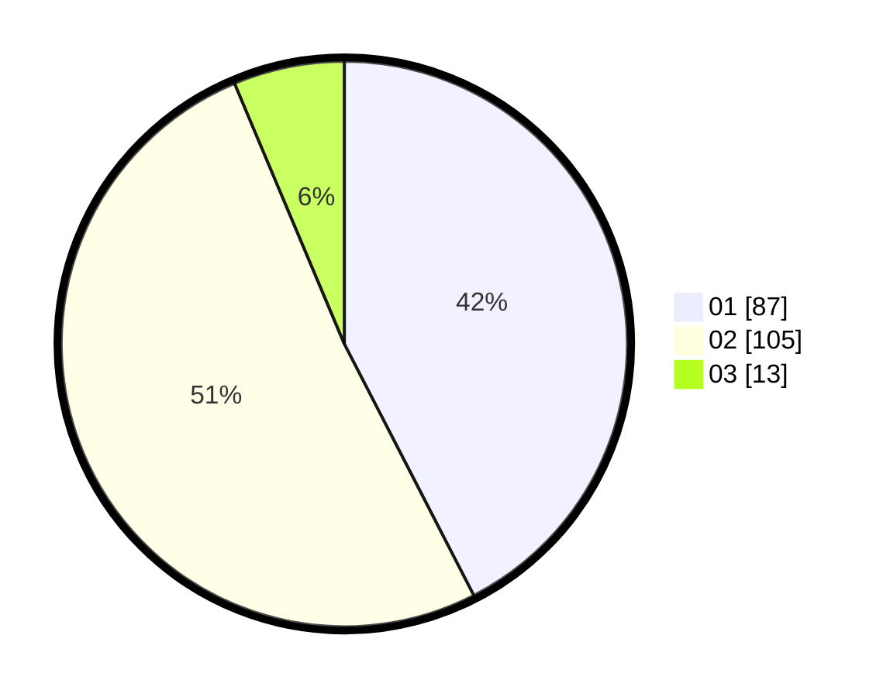

# Hasil

Hasil perolehan suara paslon dapat dilihat pada file paslon-01.txt, paslon-02.txt, dan paslon-03.txt.

Jika tidak ada, artinya data tersebut belum ada pada SIREKAP.

## Perolehan Suara

 * Paslon 01: **87**.
 * Paslon 02: **105**.
 * Paslon 03: **13**.

## Foto C Plano

https://sirekap-obj-formc.kpu.go.id/d573/pemilu/ppwp/31/73/06/10/02/3173061002155-20240214-235925--7cac6c97-a071-46dc-a46a-b9b44cf3aa52.jpg

https://sirekap-obj-formc.kpu.go.id/d573/pemilu/ppwp/31/73/06/10/02/3173061002155-20240215-000015--d94c3ebb-8117-4593-b84d-cdc7ffbb50c4.jpg
